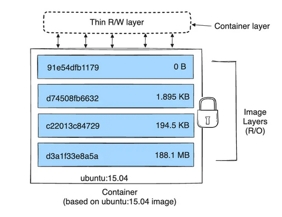
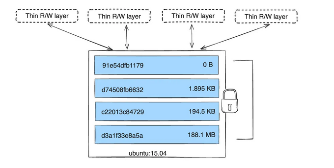

# Kiến thức tổng quan về docker

## Docker là gì ?
**Docker** là một nền tảng đóng gói ứng dụng và môi trường của nó vào một `container`. Mỗi `container` chạy độc lập, giống nhẹ, nhanh, giống nhau ở mọi nơi.

Các thành phần chính của **Docker** là: 
- `Dockerfile` : mô tả lệnh để build một image.
- `Docker Image` : lằ một image sau khi build `Dockerfile` thành công.
- `Docker Container` : là một instance đang chạy image, có thể hiểu như là object của một class vậy.
- `Docker Engine` : là program chạy container.
- `Docker Hub` : là kho chứa image giống như github chứa các repo.

Lifecycle như sau : `Dockerfile -> build -> image -> run -> container`.

Ưu điểm lớn nhát của **Docker** đó là chạy ứng dụng giống nhau 100% ở tất cả môi trường khác nhau như server, laptop, máy dev, ... khác mà không bị lỗi phiên bản, thiếu thư viện hay khác OS, ... Khi nó chạy, nó đóng gói toàn bộ `application + dependency + runtime + config` vào một `container` và nó luôn sử dụng môi trường đó, không phụ thuộc vào máy host, đồng nhất ở mọi nơi.

Docker kết hợp 3 công nghẹ cẩu Linux : 
- Namespaces - cô lập tài nguyên.
- cgroups - giới hạn tài nguyên.
- UnionFS (OverlayFS) - filesystem dạng lớp.
- Capability + Seccomp - sandbox bảo mật.

|Layer|Chức năng|
|-|-|
|Namespaces|	tách biệt thế giới (PID, NET, FS, USER, IPC…)|
|Cgroups	|giới hạn tài nguyên (CPU, RAM, IO)|
|Capabilities	|phân nhỏ quyền root, chỉ cho phép quyền cần thiết|
|Seccomp|	chặn syscall nguy hiểm → ngay cả root trong container cũng không dùng được|

Kết hợp lại để `container` cô lập, an toàn, nhẹ hơn VM, root cũng bị hạn chế.

### Docker Container là gì ?
**Docker container** = một process được cô lập bằng `Namespaces + Cgroups`, chạy trên kernel của host, sử dụng `image read-only` + một lớp `writable layer`, kèm sandbox bảo mật `Capabilities + Seccomp`.

### Docker Image là gì ? 
**Docker image** là một bộ `layer read-only` xếp chồng lên nhau, chứa môi trường và ứng dụng để tạo ra `container`.

### Dockerfile là gì ?
**Dockerfile** là một file text chứa tập hợp các lệnh để `Docker` tự động xây dựng (build) ra một `Docker Image`.

Dưới đây là các commands quan trong của `Dockerfile`
- `FROM` là chọn base image
    ```dockerfile
    FROM ubuntu:20.04
    ```
    - Tạo 1 layer mới
    - Quy định môi trường chạy
    - Có thể dùng nhiều FROM → multi-stage build

    ```dockerfile
    # --- STAGE 1: Builder ---
    # Đặt tên cho stage này là "builder" để lát nữa tham chiếu lại
    FROM golang:1.21 AS builder

    # Tạo thư mục làm việc
    WORKDIR /app

    # Copy code vào và biên dịch
    COPY . .
    # Lệnh này sẽ tạo ra một file thực thi tên là "myapp"
    RUN go build -o myapp main.go


    # --- STAGE 2: Runner ---
    # Bắt đầu một stage mới hoàn toàn từ image Alpine (siêu nhẹ, chỉ khoảng 5MB)
    FROM alpine:latest

    WORKDIR /root/

    # QUAN TRỌNG: Copy file "myapp" TỪ stage "builder" sang stage này
    COPY --from=builder /app/myapp .

    # Chạy ứng dụng
    CMD ["./myapp"]
    ```
    - Nếu không dùng Multi-stage (chỉ dùng 1 lệnh FROM), image của bạn sẽ nặng khoảng 800MB - 1GB (do chứa cả bộ cài Golang). Khi dùng Multi-stage như trên, image cuối cùng chỉ nặng khoảng 10MB - 20MB (chỉ có Alpine + file chạy).

- `RUN` là chạy một lệnh trong lúc build image -> tạo layer mới.
    ```dockerfile
    # Layer 1: Tải danh sách gói tin (Chiếm khoảng 20MB)
    RUN apt-get update
    # Layer 2: Cài đặt vim (Chiếm khoảng 50MB)
    RUN apt-get install -y vim
    # Layer 3: Xóa cache để giảm dung lượng
    RUN rm -rf /var/lib/apt/lists/*
    ```
    - Dùng để cài package
    - Dùng để setup environment
    - Kết quả: Image của bạn vẫn tăng thêm 70MB. Tại sao? Ở Layer 3, bạn đã xóa các file rác, nhưng các file đó thực chất vẫn nằm lì ở Layer 1 và Layer 2. Layer 3 chỉ đơn giản là "che" chúng đi không cho bạn thấy thôi. Docker vẫn phải tải cả 3 lớp này về.
    - Nên gom nhiều lệnh vào 1 RUN để giảm số layer
    ```dockerfile
    RUN apt-get update && apt-get install -y \
        python3 \
        python3-pip \
        git \
        && rm -rf /var/lib/apt/lists/*
    ```
    - Kết quả: Image chỉ tăng thêm 30MB (chỉ tính phần mềm Vim). Tại sao? Vì 3 hành động (Tải -> Cài -> Xóa) diễn ra trong cùng 1 Layer. Trước khi Layer này được đóng gói (commit), bạn đã kịp xóa rác đi rồi. Docker chỉ lưu lại kết quả cuối cùng.
    - Lưu ý: Dùng && để đảm bảo nếu lệnh trước thất bại thì lệnh sau sẽ không chạy, giúp quá trình build dừng lại ngay để bạn sửa lỗi.
    - Không nên gộp: Cài đặt thư viện hệ thống (ít thay đổi) + Copy Source Code (thay đổi thường xuyên).
- `COPY` là copy file từ host vào image.
    ```dockerfile
    COPY app.py /app/
    ```
    - Tạo layer mới
    - Không hỗ trợ tải từ URL
    ```dockerfile
    # 1. Copy file định nghĩa thư viện (Ít thay đổi) -> Tận dụng cache
    COPY requirements.txt .

    # 2. Cài thư viện (Lâu nhất) -> Tận dụng cache
    RUN pip install -r requirements.txt

    # 3. Copy mã nguồn (Thay đổi liên tục) -> Chỉ chạy lại bước này khi sửa code
    COPY . .
    ```
    - Để tận dụng tối đa COPY và Caching, hãy luôn tuân thủ thứ tự:
        - Ít thay đổi lên trước: Hệ điều hành, Thư viện hệ thống, File cấu hình dependency (package.json, go.mod, requirements.txt).
        - Cài đặt Dependency: Chạy các lệnh npm install, pip install, go mod download.
        - Hay thay đổi để sau cùng: Mã nguồn (src, .py, .js, .go).

- `ADD` giống `COPY` nhưng hỗ trợ nhiều hơn:
    - Tự giải nén .tar
    ```dockerfile
    # Giả sử bạn có file 'source-code.tar.gz' ở máy local
    # Sau khi ADD vào sẽ tự giải nén
    ADD source-code.tar.gz /app/
    ```
    - Hỗ trợ tải URL
    ```dockerfile
    # Layer 1: Tải file 100MB (Image tăng 100MB)
    ADD https://example.com/package.zip /tmp/
    # Layer 2: Giải nén và xóa file zip
    RUN unzip /tmp/package.zip && rm /tmp/package.zip
    # Vấn đề: Dù bạn đã rm file zip ở Layer 2, nhưng file zip đó vẫn nằm vĩnh viễn ở Layer 1. Image của bạn bị phình to vô ích.
    # Cách làm đúng (Thay thế ADD bằng RUN):
    # Gom tất cả vào 1 Layer: Tải -> Giải nén -> Xóa
    RUN curl -L https://example.com/package.zip -o package.zip && \
    unzip package.zip && \
    rm package.zip
    ```
- `WORKDIR` là lệnh đặt thư mục làm việc mặc định.
    ```dockerfile
    # 1. Tạo và nhảy vào thư mục /app
    WORKDIR /app

    # 2. Copy file từ máy host vào THƯ MỤC HIỆN TẠI (/app)
    COPY package.json .

    # 3. Chạy lệnh npm install ngay tại /app
    RUN npm install
    ```
    - Không tạo layer
    - Tự động tạo thư mục nếu chưa tồn tại
    - Tất cả lệnh `RUN, CMD, ENTRYPOINT` sau đó sẽ chạy trong thư mục này

- `ENV` là lệnh khai báo biến môi trường.
    ```dockerfile
    # Cách chuẩn: Khai báo biến APP_PORT giá trị 8080
    ENV APP_PORT=8080

    # Khai báo nhiều biến một lúc (Gọn gàng hơn)
    ENV APP_HOME=/usr/src/app \
        DEBUG_MODE=true \
        DATABASE_HOST=localhost

    # Định nghĩa phiên bản ở một chỗ duy nhất
    ENV NODE_VERSION=14.17.0

    # Sử dụng lại biến đó ($NODE_VERSION)
    RUN curl -O https://nodejs.org/dist/v$NODE_VERSION/node-v$NODE_VERSION-linux-x64.tar.gz
    # Nếu sau này muốn up lên Node 16, chỉ cần sửa dòng ENV đầu tiên là xong.
    # Code có thể đọc biến môi trường từ container

    # có thể override
    ENV APP_COLOR=blue
    # không nên dùng lưu API hay khóa bí mật, dễ lộ
    ```
    ```bash
    docker run -e APP_COLOR=red my-image
    ```
- `ARG` là lệnh dùng để định nghĩa các biến chỉ tồn tại trong quá trình Build Image.
    - Tính linh hoạt khi Build
    ```dockerfile
    # Định nghĩa biến VERSION, mặc định là "3.9" nếu không ai nói gì
    ARG VERSION=3.9

    # Sử dụng biến đó
    FROM python:$VERSION
    RUN echo "Dang build phien ban $VERSION"
    ```
    - Khi chạy lệnh Build (Terminal): Bạn dùng cờ --build-arg để thay thế giá trị:
    ```bash
    # Build bản 3.9 (mặc định)
    docker build -t my-python:3.9 .

    # Build bản 3.8 (ghi đè) -> Cực kỳ tiện lợi!
    docker build --build-arg VERSION=3.8 -t my-python:3.8 .
    ```
    - Giá trị có thể được lưu trong lịch sử, nên không được dùng để chứa các thông tin nhạy cảm, hãy dùng tính năng `Docker Secrets` hoặc `Mount volumes`.
    ```bash
    docker history ten_image
    ```
    - Phạm vi hoạt động
        - `ARG` nằm trước `FROM`: Chỉ dùng được ở dòng `FROM` (thường dùng để quy định version của Base Image). Nó sẽ "chết" ngay sau dòng `FROM`.
        - `ARG` nằm sau `FROM`: Dùng được cho các lệnh bên dưới `(RUN, COPY...)`, nhưng không dùng được ở dòng `FROM`.

- `EXPOSE` là lệnh khai báo port mà container sẽ sử dụng.
    - Không mở port
    - Chỉ mang tính documenting
    ```dockerfile
    EXPOSE 80
    ```
    - Dùng với `bash docker run -p 8080:80`

- `CMD` là command mặc định khi container chạy.
    - Dễ bị override
    ```dockerfile
    # Mặc định chạy Python
    CMD ["python", "app.py"]
    ```
    ```bash
    docker run my-image echo "Hello World"
    ```
    - `Docker` bỏ qua lệnh `CMD` trong Dockerfile và chạy lệnh echo "Hello World" thay thế.
    - Nên dùng `Exec form` (chuẩn `JSON`)
    - Có thể viết nhiều dòng `CMD` nhưng chỉ dòng cuối mới có hiệu lực.
    ```dockerfile
    CMD ["echo", "Lệnh này vô dụng"]
    CMD ["echo", "Lệnh này cũng bỏ đi"]
    CMD ["echo", "Chỉ lệnh này được chạy"]
    ```
- `ENTRYPOINT` là lệnh chính mà container luôn chạy.
    - ENTRYPOINT + CMD = command final
    ```dockerfile
    # 1. Lệnh gốc (Luôn luôn chạy)
    ENTRYPOINT ["ping"]
    
    # 2. Tham số mặc định (Nếu người dùng không nhập gì thì ping localhost)
    CMD ["localhost"]
    ```
    - Nếu người dùng nhập sẽ chạy
    ```bash
    docker run my-ping google.com
    ```
    - Vấn có thể ghi đè bằng cờ `entrypoint` nhưng không khuyến khích
    ```bash
    # Bắt buộc container chạy shell /bin/bash thay vì chạy lệnh ping
    docker run --entrypoint /bin/bash -it my-ping
    ```
- `USER` là lệnh chạy container dưới 1 user không phải root.
    - Lệnh `USER` không tự tạo `user mới`. Nó chỉ chuyển sang `user` đã có. Vì vậy, bạn thường phải tạo user trước bằng lệnh `RUN`
    ```dockerfile
    FROM python:3.9-slim

    # 1. Tạo một user mới tên là "appuser" (không cần mật khẩu, thư mục home)
    # Lưu ý: Lệnh tạo user tùy thuộc vào OS (Ubuntu dùng useradd, Alpine dùng adduser)
    RUN useradd -m appuser

    # 2. Thiết lập thư mục làm việc
    WORKDIR /app

    # 3. Copy file và cấp quyền sở hữu cho "appuser" luôn
    # (Quan trọng: Nếu không chown, file sẽ thuộc về root, appuser không đọc/ghi được)
    COPY --chown=appuser:appuser . .

    # 4. CHUYỂN QUYỀN: Từ đây trở đi, mọi thứ chạy dưới danh nghĩa "appuser"
    USER appuser

    # 5. Lệnh này sẽ chạy với quyền appuser (An toàn hơn root)
    CMD ["python", "app.py"]
    ```
    - Luôn thực hiện các hành động cần quyền Root (cài đặt thư viện, cấu hình hệ thống) Ở TRÊN, và chỉ đặt lệnh `USER` Ở GẦN CUỐI `Dockerfile` (trước `CMD/ENTRYPOINT`).
    - Để bảo mật cao hơn nữa, các hệ thống lớn (như Kubernetes) thường khuyên dùng ID số (UID) thay vì tên user.
    ```dockerfile
    # Chạy với UID 1001
    USER 1001
    ```

- `VOLUME` là lệnh tạo một vùng lưu trữ đặc biệt trên máy chủ (Host) và gắn nó vào container. Khi xóa container, vùng dữ liệu này vẫn còn nguyên.
    - Khai báo thư mục nên mount ra ngoài.
    ```dockerfile
    # Tạo điểm gắn kết tại thư mục /data
    VOLUME ["/data"]
    # Khi Docker gặp lệnh này, nó hiểu rằng: Bất cứ thứ gì ứng dụng viết vào thư mục /data đều phải được lưu ra ngoài ổ cứng thật của máy chủ, không được lưu trong Container layer.
    
    # Bước 1: Khai báo Volume tại /app/data
    VOLUME ["/app/data"]
    # Bước 2: Cố gắng tạo file trong Volume đó
    RUN touch /app/data/cautruc.txt
    ```
    - Một khi đã khai báo `VOLUME`, bạn không thể thay đổi dữ liệu bên trong thư mục đó ở các bước build tiếp theo. Cho nên luôn đặt lệnh `VOLUME` ở CUỐI CÙNG của `Dockerfile` (sau khi đã copy code và cài đặt xong xuôi).
    ```dockerfile
    FROM postgres:13
    ENV PGDATA /var/lib/postgresql/data
    # Khai báo volume để dữ liệu DB không bị mất khi update container
    VOLUME /var/lib/postgresql/data
    ```
- `LABEL` là lệnh thêm metadata vào image.
    - Dùng cho CI/CD, security scan, info…
    ```dockerfile
    LABEL version="1.0" \
          description="Ứng dụng Web bán hàng viết bằng Node.js" \
          maintainer="nguyenvana@example.com" \
          license="MIT"
    ```
- `SHELL` là lệnh thay shell mặc định.
    - Lệnh SHELL ảnh hưởng đến tất cả các lệnh `RUN, CMD, ENTRYPOINT` viết ở dạng shell form nằm bên dưới nó.
    ```dockerfile
    # 1. Đổi shell sang bash và bật chế độ nghiêm ngặt (pipefail)
    SHELL ["/bin/bash", "-o", "pipefail", "-c"]

    # 2. Chạy lại lệnh cũ
    RUN wget -O - http://link-bi-hong.com/file.tar.gz | tar xz

    # KẾT QUẢ TỐT:
    # Docker thấy wget lỗi -> Nó báo: "Build THẤT BẠI" ngay lập tức.
    # Bạn biết ngay để sửa.

    # Chuyển sang dùng PowerShell làm mặc định
    SHELL ["powershell", "-command"]

    RUN Write-Host "Hello from PowerShell"
    ```
- `ONBUILD` chỉ chạy khi image được dùng làm base cho image khác.
    - Dùng khi tạo base image framework.
    ```dockerfile
    FROM python:3.9

    WORKDIR /app

    # Những lệnh này CHƯA CHẠY NGAY, mà chờ image con
    ONBUILD COPY requirements.txt .
    ONBUILD RUN pip install -r requirements.txt
    ONBUILD COPY . .
    ```
    ```dockerfile
    # Ngay sau dòng này, Docker tự động chạy COPY và RUN pip install ở trên
    FROM python-base
    
    # Chỉ cần khai báo lệnh chạy
    CMD ["python", "app.py"]
    ```

### Các kiến thức bổ sung

####  Container là gì ?
**Container** thì được hiểu như y nghĩa của nó `container` và bên trong nó sẽ gồm các thùng hàng như : `application + dependency + runtime + config` và đóng gói lại thành một đơn vị duy nhất -> `container`.


||Container|Virtual Machine|
|-|-|-|
|Boot time|Vài giây|Vài phút|
|Resource|Rất nhẹ|Nặng|
|Kernel|Dùng chung kernel với host|Mỗi vm có kernel riêng|
|Target|Chạy app|Chạy OS đầy đủ|

- Nó dùng chung `kernel` hệ điều hành nên :
    - khởi động rất nhanh
    - nhẹ hơn máy ảo vm rất nhiều
    - chạy được hàng trăm container trên 1 máy


##### Kernel là gì ?
**Kernel** là lõi của hệ điều hành (Linux, Windows, ...), nó nằm ở phần trung tâm của hệ điều hành: `User application` -> `System libraries` -> `Kernel` -> `Hardware` và nó làm nhiệm vụ quản lý CPU, RAM, DISK, NETWORK, .... 

##### Namespaces là gì ?
**Namespaces** là cơ chế của `linux kernel` để cô lập tài nguyện giữa các `process`. Mỗi `container` thực chất là một nhóm `process`, và nhờ `namespaces`, các `process` đó thấy được: 
- PID riêng
- network riêng
- filesystem riêng
- user riêng
- hostname riêng

-> Và chúng nghĩ rằng mình là một máy độc lập

- Có 8 loại namespace chính :

|Namespaces|Ý nghĩa|
|-|-|
|pid|Mỗi container có PID riêng|
|net|Mỗi container có interface riêng (eth0), iptables riêng|
|mnt|Mỗi container có filesystem root riêng (/), mount riêng|
|ipc|Không container nào truy cập shared memory của container khác|
|uts|Container đặt hostname riêng|
|user|Root trong container không phải root thật trên host (an toàn hơn)|
|cgroup|Cô lập dùng để tránh lộ cấu trúc cgroups host|
|time|Cô lập clock/time|

##### OverlayFS (Union filesystem) là gì ?
Là một filesystem dạng lớp `layered`, cho phép ghép nhiều filesystem lại thành một filesystem duy nhất. Nó làm được nhờ cơ chế `read-only layers` từ **Docker Image** và `read-write layers` của **Container**. Khi **Docker Container** chạy, Docker tạo ra một filesystem như sau : **Container FS** = `Image Layers (read-only)` + `Container Layer (read-write)`.

- Lấy ví dụ dễ hiểu như sau : `Dockerfile` -> sinh ra `Docker Image` thì mỗi dòng `RUN/COPY/ADD` trong `Dockerfile` sẽ tạo ra một `layer read-only` và kết quả cuối cùng là nhiều `layer read-only` xếp chồng lên nhau:
```dockerfile
Layer 1: FROM ubuntu
Layer 2: RUN apt update
Layer 3: RUN apt install python3
Layer 4: COPY app.py /app/
Layer 5: RUN pip install -r requirements.txt
```
- Khi chạy `container` thì `docker` sẽ thêm một lớp `R/W layer` ở trên cùng và sau đó `container` ghi vào `Container Layer`

<div style="text-align: center;">
  
</div>
<div style="text-align: center;">
  
</div>

- Có thể thấy được một lớp `Thin R/W layer` (lớp ghi/đọc) được đặt lên trên cùng. Mọi thay đổi dữ liệu khi `container` chạy sẽ nằm ở đây.
- Khi muốn chạy nhiều `container` giống nhau thì chỉ việc tạo ra một image và chạy nó một cách bình thường, `Docker` cũng chỉ lưu trữ một bản copy trên đĩa cứng gốc, giúp tiết kiệm 
dung lượng rất nhiều.

- Cơ chế `Copy-On-Write (COW)` rất quan trong nếu bạn cấn sửa một file nằm trong image:
    - `Docker` không sửa trực tiếp file `read-only`.
    - Nó copy file đó lên `Container Layer`.
    - `Container` chỉnh sửa bản copy này, `image` không bị ảnh hưởng.
- Nếu muốn thay đổi thẳng thì có 2 cách :
    - Commit `container` thành `image`
    ```bash
    docker commit <container_id> newimage
    ```
    - Viết Dockerfile lại rồi build mới.

##### Cgroups (control groups) là gì ?
**cgroups** là cơ chế kernel để giới hạn và quản lý tài nguyên của container.
- Giới hạn (limit) – CPU, RAM, I/O.
- Đo lường (measure) – xem container dùng bao nhiêu tài nguyên.
- Ưu tiên (prioritize) – container nào được CPU trước.
- Cô lập (isolate) – giới hạn tài nguyên không "ăn" của nhau.
- Quản lý nhóm process – gộp process thành 1 nhóm để quản lý.

Các loại **cgroups** : 
|Controller|Ý nghĩa|
|-|-|
|cpu|giới hạn cpu|
|cpuacct|đo cpu đã dùng|
|cpuset|gom cpu/numa node|
|memory|giới hạn RAM, swap|
|blkio|giới hạn I/O disk|
|pids|giới hạn số process|
|devices|giới hạn quyến access thiết bị|
|freezer|tạm dừng/thaw process|
|net_cls, net_prio|QoS network|

##### Linux Capabilities và Seccomp là gì ?
1. Linux Capabilities – chia nhỏ quyền root
    - Trong Linux, tài khoản `root` có quyền cao nhất, có thể thực thi bất cứ thứ gì. Nhưng `container` chạy root bên trong `container` thì không được phép hoạt động như root thật. Vì vậy phải chia quyền root thành nhiều quyền nhỏ, ví dụ như : 
    
    |Capability|Quyền|
    |-|-|
    |CAP_NET_ADMIN|thay đổi network, tạo interface|
    |CAP_SYS_ADMIN|gần như quyền root (mount, unshare,…)|
    |CAP_CHOWN|đổi owner file|
    |CAP_KILL|kill process|
    |CAP_SYS_TIME|chỉnh thời gian hệ thống|

    - `Docker` mặc định bỏ hầu hết `capabilities`, chỉ giữ vài quyền tối thiểu như: `CAP_CHOWN, CAP_NET_BIND_SERVICE, CAP_SETUID, CAP_SETGID`, -> Nhờ đó root trong `container` yếu hơn rất nhiều so với root trên host.
2. Seccomp (Secure Computing Mode) - chặn syscall nguy hiểm
    - Seccomp = cho phép hoặc chặn những system call (lời gọi vào kernel). Kernel Linux có ~300+ syscall, `Docker` dùng seccomp profile để chặn các syscall nguy hiểm, ví dụ:
        - ptrace → debug/chèn code vào process host
        - kexec_load → nạp kernel mới 😱
        - mount → mount filesystem host
        - setns → nhảy vào namespace khác
        - reboot → reboot máy host luôn 😆
    - Docker mặc định chặn ~44 syscalls.
