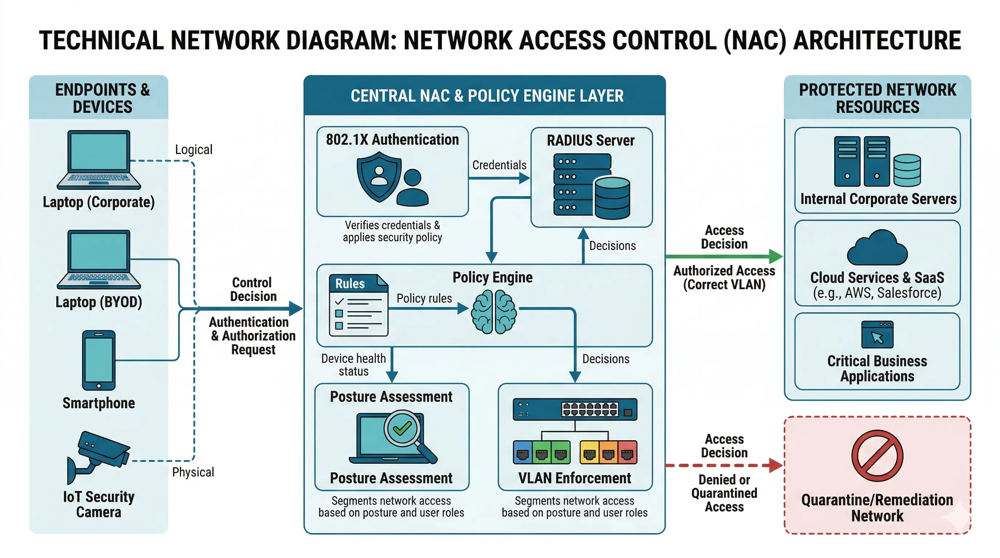
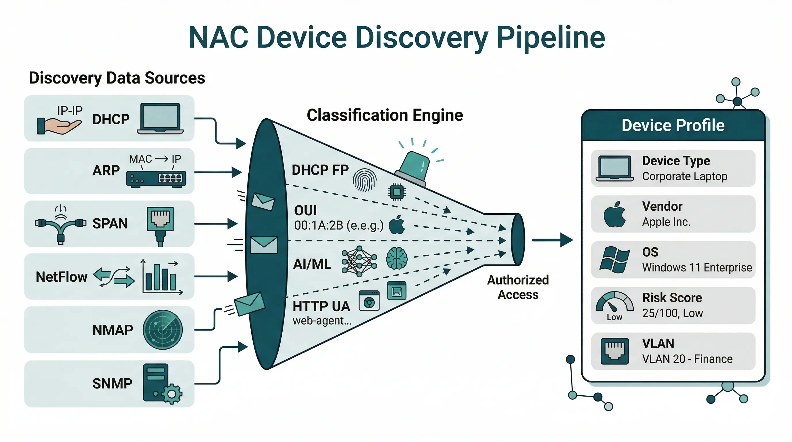
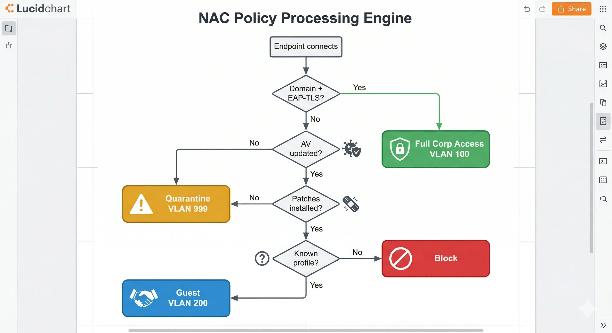
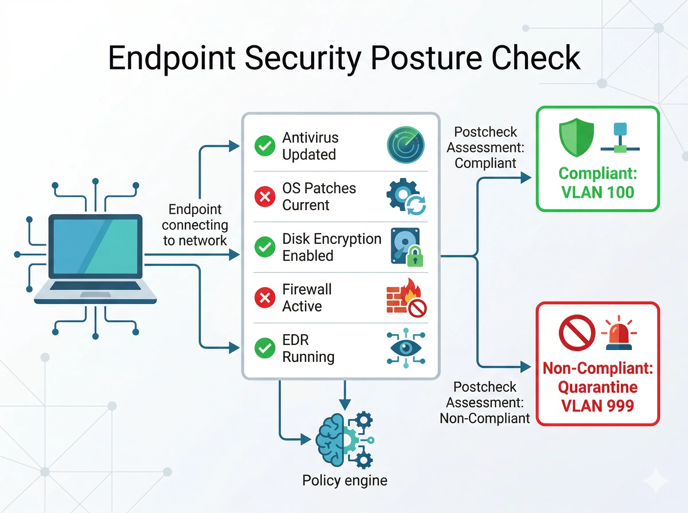
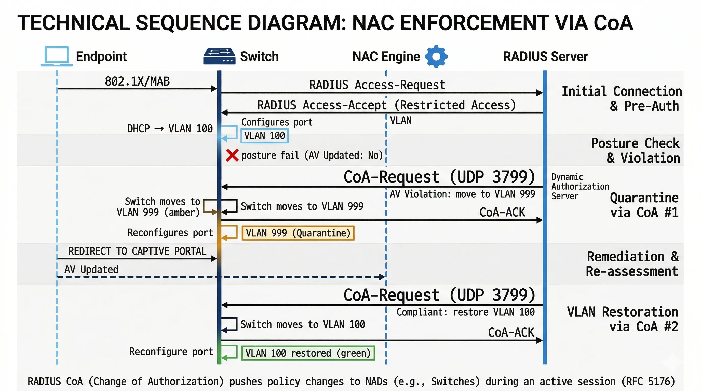

# Tìm hiểu các tính năng của Network Access Control

## 1. Tổng quan — NAC Feature Stack

Network Access Control (NAC) là tập hợp các tính năng kỹ thuật phân tầng, phối hợp với nhau để kiểm soát **ai**, **cái gì**, và **bằng cách nào** có thể truy cập tài nguyên mạng. Không có một giao thức đơn lẻ nào là NAC — đây là một kiến trúc đa tầng.

> **Nguyên tắc cốt lõi:** *Never trust, always verify* — Không tin tưởng ngầm định; mọi thực thể đều phải được xác thực, đánh giá và được cấp quyền tối thiểu cần thiết.

### 1.1 NAC Protocol Stack

```
╔══════════════════════════════════════════════════════════════════════════╗
║                         NAC PROTOCOL STACK                              ║
╠═══════════════════════╦══════════════════════════╦═══════════════════════╣
║  Tầng chức năng       ║  Giao thức / Công nghệ   ║  Port / Layer         ║
╠═══════════════════════╬══════════════════════════╬═══════════════════════╣
║  Discovery            ║  DHCP, ARP, SNMP, NMAP   ║  UDP 67/161, Mirror   ║
║  Ai đang có mặt?      ║  SPAN/RSPAN, NetFlow      ║  UDP 2055/4739        ║
║                       ║  CDP/LLDP, mDNS           ║  L2 multicast         ║
╠═══════════════════════╬══════════════════════════╬═══════════════════════╣
║  Authentication       ║  IEEE 802.1X              ║  EAPOL (L2, 0x888E)  ║
║  Đây là ai?           ║  EAP-TLS / PEAP / FAST    ║  Inside 802.1X        ║
║                       ║  MAB (MAC Auth Bypass)    ║  RADIUS               ║
╠═══════════════════════╬══════════════════════════╬═══════════════════════╣
║  AAA Transport        ║  RADIUS Authentication    ║  UDP 1812             ║
║  Kênh xác thực        ║  RADIUS Accounting        ║  UDP 1813             ║
║                       ║  CoA / Disconnect         ║  UDP 3799 (RFC 5176)  ║
║                       ║  TACACS+                  ║  TCP 49               ║
╠═══════════════════════╬══════════════════════════╬═══════════════════════╣
║  Posture              ║  WMI (Windows)            ║  TCP 135 / 445        ║
║  Thiết bị an toàn?    ║  SSH (Linux/Unix)         ║  TCP 22               ║
║                       ║  Agent (SecureConnector)  ║  TCP 10003            ║
╠═══════════════════════╬══════════════════════════╬═══════════════════════╣
║  Policy Engine        ║  Rule engine, AI/ML       ║  Internal             ║
║  Áp chính sách        ║  Risk scoring             ║  Internal             ║
╠═══════════════════════╬══════════════════════════╬═══════════════════════╣
║  Enforcement          ║  RADIUS CoA               ║  UDP 3799             ║
║  Thực thi             ║  SNMP Write               ║  UDP 161              ║
║                       ║  ACL / VLAN / SGT         ║  Via RADIUS AVP       ║
╠═══════════════════════╬══════════════════════════╬═══════════════════════╣
║  Guest / BYOD         ║  Captive Portal, MDM      ║  HTTP/HTTPS 443       ║
╠═══════════════════════╬══════════════════════════╬═══════════════════════╣
║  Accounting           ║  RADIUS Accounting        ║  UDP 1813             ║
║  Audit & Compliance   ║  Syslog / CEF             ║  UDP 514 / TCP 6514   ║
║                       ║  SNMP Trap                ║  UDP 162              ║
╚═══════════════════════╩══════════════════════════╩═══════════════════════╝
```

### 1.2 Luồng tổng thể NAC Session

```
[Endpoint kết nối vào switch]
         │
         ▼
  [DISCOVERY] ─── DHCP snooping + ARP + SPAN + SNMP
         │         → Biết: IP, MAC, hostname, device type
         ▼
  [AUTHENTICATION] ─── 802.1X / MAB / Web Auth → RADIUS
         │              → Xác minh danh tính
         ▼
  [POSTURE CHECK] ─── WMI / SSH / Agent
         │             → Kiểm tra AV, patch, encryption...
         ▼
  [POLICY DECISION] ─── NAC engine đối chiếu policy
         │               → Allow / Quarantine / Remediate / Deny
         ▼
  [ENFORCEMENT] ─── CoA / SNMP Write / ACL / VLAN change
         │          → Switch / WLC áp dụng tức thì
         ▼
  [MONITORING] ─── NetFlow + Syslog + SNMP Trap
                   → Phát hiện anomaly ongoing
```

### 1.3 Feature Summary Table

| Tầng chức năng | Tính năng | Giao thức / Công nghệ | Port |
|---|---|---|---|
| Discovery | Phát hiện & phân loại thiết bị | DHCP, ARP, SNMP, NMAP, SPAN, NetFlow | UDP 67/161, Mirror |
| Authentication | Xác thực danh tính | IEEE 802.1X, EAP-TLS, PEAP, MAB | EAPOL (L2) |
| AAA Transport | Vận chuyển AAA | RADIUS, TACACS+, CoA (RFC 5176) | UDP 1812/1813/3799 |
| Posture | Đánh giá trạng thái bảo mật | WMI, SSH, Agent (SecureConnector) | TCP 135/22/10003 |
| Policy Engine | Định nghĩa & áp dụng chính sách | Rule engine, AI/ML scoring | Internal |
| Enforcement | Thực thi quyền truy cập | VLAN, ACL, SGT, CoA, SNMP Write | UDP 3799/161 |
| Guest/BYOD | Quản lý truy cập đặc biệt | Captive Portal, MDM integration | HTTP/HTTPS 443 |
| Accounting | Ghi nhận & tuân thủ | RADIUS Accounting, Syslog, CEF | UDP 1813/514 |

<div style="text-align: center;">
  
</div>

---

## 2. Visibility — Network Discovery

> **Mục đích:** Phát hiện, nhận diện và phân loại mọi thiết bị trên mạng theo thời gian thực.

### 2.1 Vai trò kỹ thuật

Visibility là tầng nền tảng của NAC. **Không thể kiểm soát những gì không thấy được.** NAC phải duy trì một *real-time inventory* của tất cả thiết bị — kể cả những thiết bị chưa xác thực, không có agent, hay không thuộc domain.

### 2.2 Passive Discovery Methods

Passive methods **không tạo traffic** — chỉ lắng nghe. Đây là cách phát hiện nhanh nhất và ít xâm phạm nhất.

| Method | Giao thức / Port | Thông tin thu thập | Thời điểm phát hiện |
|---|---|---|---|
| **DHCP Snooping** | UDP 67/68 | MAC, Hostname (Opt.12), OS FP (Opt.55), Vendor (Opt.60) | Trước khi có IP |
| **ARP Monitoring** | L2 Broadcast | IP-to-MAC mapping, gratuitous ARP | Ngay khi kết nối |
| **SPAN/RSPAN DPI** | Port mirror | HTTP User-Agent, mDNS, SMB NetBIOS, EAPOL frames | Real-time |
| **NetFlow / IPFIX** | UDP 2055/4739 | Flow records: src/dst IP, port, bytes, protocol | Post-connection |
| **CDP / LLDP** | L2 Multicast | Neighbor device type, model, capabilities | Real-time |
| **mDNS / Bonjour** | UDP 5353 | Apple device services, IoT UPnP | Real-time |

**DHCP Option 55 — OS Fingerprinting:**

```
Windows 10/11:  1, 15, 3, 6, 44, 46, 47, 31, 33, 121, 249, 252
macOS:          1, 121, 3, 6, 15, 119, 252, 95, 44, 46
Ubuntu Linux:   1, 28, 2, 3, 15, 6, 119, 12, 44, 47, 26, 121, 42
iOS:            1, 121, 3, 6, 15, 119, 252, 95, 44, 46
Android:        1, 33, 3, 6, 15, 28, 51, 58, 59
Cisco IP Phone: 1, 66, 150, 3, 6
```

### 2.3 Active Discovery Methods

Active methods **tạo traffic chủ động** để thu thập thông tin chi tiết hơn — chỉ kích hoạt sau khi passive xác nhận device tồn tại.

| Method | Protocol | Port | Thông tin thu thập | Credential cần |
|---|---|---|---|---|
| **NMAP Scan** | ICMP/TCP | Varies | Open ports, OS detection (TCP/IP stack FP), service version | Không |
| **SNMP v3 Query** | UDP | 161 | sysDescr, sysName, interface list, ARP table | SNMPv3 creds |
| **WMI** | DCOM/RPC | TCP 135/445 | OS version, AV status, patch level, logged-in user | Domain admin |
| **SSH Query** | SSH | TCP 22 | OS, kernel, running processes, open ports | SSH key/password |
| **HTTP/S Probe** | HTTP | 80/443 | Server header, device model, web interface type | Không |
| **SMB** | SMB | TCP 445 | Windows domain, hostname, share list | Domain creds |

### 2.4 Device Classification Engine

```
Raw Data (DHCP, ARP, NMAP, HTTP, SNMP, WMI, traffic behavior)
        │
        ▼
┌─────────────────────────────────────────────────────────┐
│            Classification Engine                        │
│  1. DHCP Fingerprint DB  — Option 55 sequence match     │
│  2. TCP/IP Stack FP      — TTL, window size, TCP opts   │
│  3. OUI Lookup           — MAC prefix → Vendor          │
│  4. HTTP User-Agent      — Browser / OS string parse    │
│  5. mDNS/UPnP parsing    — Service type → device role   │
│  6. AI/ML Behavioral     — Traffic pattern → device type│
└──────────────────────────┬──────────────────────────────┘
                           │
                           ▼
              Device Profile (Real-time Inventory):
              MAC · IP · Hostname · OS · Device Type
              Vendor · Model · Switch Port · VLAN
              User · Risk Score · Compliance Status
```

**MAC OUI — ví dụ:**

| OUI Prefix | Vendor | Device Type |
|---|---|---|
| `00:50:56` | VMware | Virtual Machine |
| `B8:27:EB` | Raspberry Pi Foundation | IoT/Embedded |
| `00:1A:2B` | Cisco | Network Equipment |
| `3C:22:FB` | Apple | macOS / iOS |
| `DC:A6:32` | Raspberry Pi | IoT |
| `00:23:AE` | Hikvision | IP Camera |

<div style="text-align: center;">
  
</div>

---

## 3. Authentication & Identity Management


> **Mục đích:** Xác minh danh tính người dùng và thiết bị trước khi cấp bất kỳ quyền truy cập nào.

### 3.1 IEEE 802.1X — Port-Based Authentication

**IEEE 802.1X** (chuẩn 802.1X-2020) là cơ chế kiểm soát truy cập Layer 2. Một switch port ở trạng thái **Unauthorized** cho đến khi xác thực thành công — không có exception.

```
┌────────────────────┐  EAPOL   ┌─────────────────────┐  RADIUS  ┌─────────────────────┐
│     SUPPLICANT     │◄────────►│    AUTHENTICATOR    │◄────────►│  AUTH SERVER        │
│  (Endpoint Device) │  0x888E  │  (Switch / WLC)     │  UDP1812 │  (RADIUS / NAC)     │
│  - Windows PC      │          │  - Cisco IOS        │          │  - Cisco ISE        │
│  - macOS           │          │  - Aruba WLC        │          │  - Forescout        │
│  - wpa_supplicant  │          │  - Fortinet GW      │          │  - FreeRADIUS       │
└────────────────────┘          └─────────────────────┘          └─────────────────────┘
  EAP over LAN (EAPOL)        Forward EAP payload via RADIUS     Validate + return attrs
```

| Thành phần | Chức năng | Giao thức |
|---|---|---|
| **Supplicant** | Khởi tạo EAP exchange; giữ session state | EAPOL (Ethertype `0x888E`) |
| **Authenticator** | Chặn tất cả L2 traffic (trừ EAPOL); relay EAP | EAPOL inbound, RADIUS outbound |
| **Authentication Server** | Xác minh credential; trả về RADIUS attributes | RADIUS UDP 1812/1813 |

### 3.2 Luồng xác thực 802.1X đầy đủ

```
Supplicant             Authenticator (Switch)          Auth Server (RADIUS)
    │                          │                                │
    │──── EAPOL-Start ─────────►│                                │
    │◄─── EAP-Request/Identity ─│                                │
    │──── EAP-Response/Identity►│                                │
    │                          │──── RADIUS Access-Request ────►│
    │                          │◄─── RADIUS Access-Challenge ───│
    │◄─── EAP-Request/Method ───│                                │
    │   ╔══ EAP Method Exchange (TLS / PEAP tunnel) ══╗         │
    │   ╚══ (multiple round-trips depending on method) ╝        │
    │──── EAP-Response/Method ─►│                                │
    │                          │──── RADIUS Access-Request ────►│
    │                          │                                │ [Verify credential]
    │                          │◄─── RADIUS Access-Accept ──────│
    │                          │     Tunnel-Type = VLAN (13)    │
    │                          │     Tunnel-Private-Group-Id=100│
    │◄─── EAP-Success ──────────│     Filter-Id = CORP-ACL      │
    │   ══ ACCESS GRANTED ══    │                                │
    │                          │──── RADIUS Accounting-Start ──►│
```

### 3.3 EAP Methods — So sánh

| EAP Method | Auth Client | Auth Server | Tunnel | Bảo mật | PKI yêu cầu | Use Case |
|---|---|---|---|---|---|---|
| **EAP-TLS** | X.509 Cert | X.509 Cert | TLS mutual | ★★★★★ | Cả 2 phía | Managed corp devices |
| **PEAP/MSCHAPv2** | Username+Pass | Server Cert | TLS (1-way) | ★★★☆☆ | Server only | Domain-joined PC |
| **EAP-FAST** | PAC token | PAC token | TLS | ★★★★☆ | Optional | Cisco environments |
| **EAP-TTLS** | Username+Pass | Server Cert | TLS (1-way) | ★★★☆☆ | Server only | Mixed OS |
| **EAP-MD5** | MD5(password) | Không | Không | ★☆☆☆☆ | Không | Legacy — **KHÔNG dùng** |

**EAP-TLS Handshake (chuẩn production):**

```
Supplicant                                 RADIUS Server
    │──── TLS ClientHello ─────────────────────►│
    │◄─── TLS ServerHello + Server Cert ─────────│
    │    [Verify Server Cert vs trusted CA]       │
    │──── Client Certificate + Finished ─────────►│
    │    [RADIUS verifies Client Cert vs CA]      │
    │    [Check CN/SAN, validity, CRL/OCSP]       │
    │◄─── EAP-Success ────────────────────────────│
```

**PKI Infrastructure bắt buộc cho EAP-TLS:**
```
Root CA (internal / Microsoft AD CS)
└── Intermediate CA
    ├── RADIUS Server Cert
    │   ├── CN: radius.corp.local
    │   └── EKU: Server Authentication (1.3.6.1.5.5.7.3.1)
    └── Endpoint Certs (via GPO / SCEP / NDES / MDM)
        ├── CN: hostname hoặc UPN
        └── EKU: Client Authentication (1.3.6.1.5.5.7.3.2)
CRL Distribution Point / OCSP Responder
```

### 3.4 MAC Authentication Bypass (MAB)

Dành cho thiết bị **không hỗ trợ 802.1X** (IoT, IP phone, printer, camera):

```
Switch (Authenticator)                    RADIUS Server
      │ [Device kết nối, KHÔNG gửi EAPOL]      │
      │ [Switch chờ dot1x timeout ~30s]         │
      │──── RADIUS Access-Request ─────────────►│
      │     User-Name = "00-1a-2b-3c-4d-5e"    │ ← MAC thay username
      │     User-Password = "001a2b3c4d5e"      │ ← MAC thay password
      │     Service-Type = Call-Check (10)      │
      │◄─── RADIUS Access-Accept ───────────────│
      │     Tunnel-Private-Group-Id = "300"     │ ← IoT VLAN
```

> ⚠️ **Cảnh báo bảo mật:** MAB dễ bị bypass bằng **MAC spoofing**. Luôn kết hợp MAB với device profiling (DHCP fingerprint, behavior analysis). Không dùng MAB đơn độc cho thiết bị có quyền truy cập cao.

### 3.5 Port States

| State | Điều kiện | Traffic được phép | Khi nào xảy ra |
|---|---|---|---|
| **Unauthorized** | Mặc định khi connect | EAPOL only (`0x888E`) | Trước khi xác thực |
| **Authorized** | Auth thành công | Full data theo VLAN/ACL | Sau RADIUS Access-Accept |
| **Guest VLAN** | 802.1X timeout | Giới hạn theo Guest policy | Non-dot1x device |
| **Auth-Fail VLAN** | Sai credential | Giới hạn theo Fail policy | Wrong password |
| **Critical VLAN** | RADIUS server down | Theo Critical policy | RADIUS unreachable |
| **Restricted VLAN** | Posture fail | Quarantine / Remediation | Post-auth compliance fail |

---

## 4. Policy Definition & Management

> **Mục đích:** Định nghĩa, quản lý và thực thi các quy tắc kiểm soát truy cập linh hoạt theo ngữ cảnh.

### 4.1 Cấu trúc Policy

```
╔═══════════════════════════════════════════════════════════════════╗
║                   FORESCOUT / NAC POLICY STRUCTURE               ║
╠═══════════════════════════════════════════════════════════════════╣
║  Name: "Windows Compliance — AV & Patch Enforcement"             ║
╠═══════════════════════════════════════════════════════════════════╣
║  SCOPE (Áp dụng cho):                                            ║
║    ├── Device Type = Windows PC                                  ║
║    └── IP belongs to: 10.10.0.0/16                               ║
╠═══════════════════════════════════════════════════════════════════╣
║  CONDITIONS (AND/OR logic):                                      ║
║    ├── [Group: Non-Compliant]                                    ║
║    │   ├── [OR] AV Product: NOT installed                        ║
║    │   ├── [OR] AV Signatures: updated > 7 days ago              ║
║    │   └── [OR] Critical OS Patches: ANY missing                 ║
║    └── [Group: Compliant]                                        ║
║        ├── AV Product: installed AND running                     ║
║        ├── AV Signatures: updated within 3 days                  ║
║        └── Critical OS Patches: ALL installed                    ║
╠═══════════════════════════════════════════════════════════════════╣
║  ACTIONS:                                                        ║
║    ├── [Non-Compliant]:                                          ║
║    │   ├── Assign VLAN: 999 (Quarantine)                        ║
║    │   ├── HTTP Redirect: https://remediation.corp.com           ║
║    │   ├── Send SNMP Trap to SIEM                               ║
║    │   └── Send Email to security@corp.com                       ║
║    └── [Compliant]:                                              ║
║        └── Assign VLAN: 100 (Corporate)                         ║
╚═══════════════════════════════════════════════════════════════════╝
```

### 4.2 Policy Condition Properties

| Category | Property | Ví dụ giá trị | Data Source |
|---|---|---|---|
| **Network** | IP, MAC, VLAN, Switch Port | `10.10.1.0/24`, VLAN `100` | DHCP, ARP, SNMP |
| **Classification** | Device Type, OS, OS Version | `Windows PC`, `iOS 17` | DHCP FP, NMAP, WMI |
| **Identity** | Domain, Username, AD Group | `CORP\Domain Users` | WMI, Kerberos, AD |
| **Compliance** | AV installed, AV updated, Patch level | `Defender` updated < 7 days | WMI, SSH, Agent |
| **Running Process** | Process name running/not-running | `CrowdStrikeFalconSensor.exe` | WMI, SSH |
| **Open Ports** | Port X is open | Port `3389` open (RDP exposed) | NMAP |
| **Authentication** | 802.1X status, Auth method | `EAP-TLS`, `MAB`, `Unauthenticated` | RADIUS |
| **Time** | Time-of-day, Day-of-week | Mon–Fri 08:00–18:00 | System clock |
| **Risk Score** | NAC AI risk score | Score > 70 | Scoring engine |

### 4.3 Policy Priority & Processing

```
Devices in scope
      │
      ▼
Policy 1 (Highest Priority)
  "Known Safe — Domain + EAP-TLS + AV Compliant"
      ├── Match? → Full Access VLAN 100 → STOP
      └── No match? → continue
      ▼
Policy 2
  "Windows Non-Compliant — AV/Patch issue"
      ├── Match? → Quarantine VLAN 999 + Redirect → STOP
      └── No match? → continue
      ▼
Policy 3
  "Guest / BYOD — Non-domain device"
      ├── Match? → Guest VLAN 200 + Limited ACL → STOP
      └── No match? → continue
      ▼
Policy N (Catch-all — Lowest Priority)
  "Unknown / Unclassified"
      └── Action: Quarantine VLAN 999 + Alert

───────────────────────────────────────────────
Best practices:
  ✅ Whitelist known-good ở priority cao nhất
  ✅ Specific rules trước, generic rules sau
  ✅ Catch-all "quarantine unknown" ở cuối cùng
  ✅ Dùng "Continue" khi muốn áp nhiều policy
```
<div style="text-align: center;">
  
</div>

---


## 5 Posture Assessment

> **Mục đích:** Đánh giá trạng thái bảo mật của endpoint trước và sau khi cấp quyền truy cập.

### 5.1 Posture vs Authentication

> **Authentication** xác minh DANH TÍNH: "Đây có phải là `jsmith` không?"  
> **Posture** xác minh TRẠNG THÁI: "Thiết bị của `jsmith` có đủ an toàn để vào mạng không?"

Đây là hai tầng **độc lập** — một thiết bị có thể xác thực thành công nhưng vẫn bị quarantine nếu posture thất bại.

### 5.2 Agentless Posture — WMI (Windows)

Forescout và các NAC solution dùng **WMI remote query** để kiểm tra endpoint mà không cần cài agent:

| Check | WMI Class / Query | Kết quả mong đợi |
|---|---|---|
| **AV Product** | `SELECT * FROM AntiVirusProduct` (SecurityCenter2) | `productState`: `0x1000` = enabled, `0x1010` = updated |
| **OS Patch Level** | `SELECT HotFixID FROM Win32_QuickFixEngineering` | KB list → compare vs required KB database |
| **Disk Encryption** | `SELECT ProtectionStatus FROM Win32_EncryptableVolume` | `1` = Protected (BitLocker ON) |
| **Windows Firewall** | `Get-NetFirewallProfile -Profile Domain` | `Enabled: True` |
| **Running Processes** | `SELECT Name FROM Win32_Process` | Verify EDR agent, detect unauthorized software |
| **Logged-in User** | `SELECT UserName FROM Win32_ComputerSystem` | Map device to user identity |
| **Domain Membership** | `SELECT Domain FROM Win32_ComputerSystem` | `CORP` vs `WORKGROUP` (BYOD) |

### 5.3 Agentless Posture — SSH (Linux/macOS)

```bash
# Kernel version → compare vs known vulnerable versions
uname -r

# OS distro and version
cat /etc/os-release

# Verify EDR/AV agent running
systemctl status <service>

# Pending security updates
apt list --upgradable 2>/dev/null | grep -i security
yum check-update --security

# Firewall status
ufw status verbose
iptables -L -n
```

### 5.4 Agent-based Posture

| Capability | Agentless (WMI/SSH) | Agent-based (SecureConnector) |
|---|---|---|
| OS patch level | ✅ (poll-based) | ✅ (real-time) |
| AV installed & updated | ✅ WMI | ✅ real-time |
| Registry key check | ⚠️ Hạn chế | ✅ Full access |
| Real-time change detection | ❌ Polling ~5 phút | ✅ Event-driven |
| Self-remediation | ❌ | ✅ (trigger script, update AV, enable FW) |
| User notification popup | ❌ | ✅ Native popup |
| Cần credentials trên endpoint | ✅ Domain admin | ❌ Agent tự auth |

<div style="text-align: center;">
  
</div>

---

## 6 Access Control & Enforcement

> **Mục đích:** Thực thi quyền truy cập theo thời gian thực qua VLAN, ACL, CoA và API.

### 6.1 Cơ chế Enforcement — Phân cấp ưu tiên

| Cơ chế | Giao thức | Ưu điểm | Hạn chế | Priority |
|---|---|---|---|---|
| **RADIUS CoA** | UDP 3799 (RFC 5176) | Chuẩn hóa, atomic, bidirectional ACK | Cần 802.1X session active | 1 — Cao nhất |
| **SNMP Write** | UDP 161 (vmVlan OID) | Hoạt động không cần 802.1X | SNMP Write ít bảo mật hơn | 2 |
| **SSH CLI** | TCP 22 | Fallback khi SNMP không có Write | Chậm hơn, cần SSH credentials | 3 |
| **RADIUS Attributes** | UDP 1812 (Access-Accept) | VLAN/ACL/SGT lúc auth | Chỉ áp dụng lúc authenticate | Concurrent |
| **Firewall API Push** | REST HTTPS | Chặn ở L3/L4/L7 | Không phải switch-level | Supplement |

### 6.2 VLAN Segmentation

| VLAN Name | ID | Mục đích | Thiết bị được assign |
|---|---|---|---|
| **Corporate** | 100 | Full access mạng nội bộ và Internet | Managed PC domain-joined, compliant |
| **Guest** | 200 | Internet only, cách ly khỏi LAN | Visitor, BYOD chưa xác thực |
| **IoT** | 300 | Cách ly IoT, policy chặt | Camera, sensor, building mgmt |
| **Quarantine** | 999 | HTTP redirect → remediation portal | Non-compliant, unknown, infected |
| **VoIP** | 400 | QoS ưu tiên, cách ly khỏi data | IP phones (MAB auto-detect) |
| **Management** | 10 | Network devices mgmt plane | Switch, router, AP (admin only) |

### 6.3 CoA — Change of Authorization (RFC 5176)

CoA là cơ chế quan trọng nhất cho dynamic enforcement — cho phép NAC **chủ động thay đổi quyền** của một session **đang active** mà không cần ngắt kết nối.

```
NAC Server                          NAS / Switch
     │                                   │
     │──── CoA-Request (UDP 3799) ───────►│
     │     Code: 43                       │
     │     Calling-Station-Id: <MAC>      │ ← Identify session
     │     Tunnel-Type: VLAN (13)         │
     │     Tunnel-Private-Group-Id: "999" │ ← New VLAN
     │                                   │ [Switch finds session by MAC]
     │                                   │ [Apply new VLAN to port]
     │◄─── CoA-ACK ──────────────────────│ ← Success
     │     or CoA-NAK (Error-Cause) ─────│ ← Failure + reason
```

**CoA Error-Cause codes:**

| Code | Tên | Ý nghĩa |
|---|---|---|
| `401` | Unsupported Attribute | Switch không hỗ trợ attribute |
| `402` | Missing Attribute | Thiếu attribute bắt buộc |
| `403` | NAS Identification Mismatch | NAS-IP không khớp |
| `501` | Administratively Prohibited | Switch từ chối theo local policy |
| `503` | Session Context Not Found | MAC không tìm thấy trong session table |

### 6.4 End-to-End Enforcement Flow

```
T+00s: Windows PC kết nối vào switch port Gi0/1
T+02s: [PASSIVE] Forescout nhận DHCP DISCOVER → MAC, Option 55 → Windows
T+03s: [PASSIVE] ARP broadcast → IP: 10.10.1.50 resolved
T+05s: [ACTIVE] SNMP query switch → "AA:BB:CC trên Gi0/1, VLAN 100"
T+08s: [ACTIVE] WMI query:
         → OS: Windows 10 22H2
         → AV: Windows Defender, last updated: 45 days ← VI PHẠM
         → Patch: KB5025221 missing ← VI PHẠM
T+09s: [POLICY] Rule "Non-Compliant" → MATCH → Action: Quarantine VLAN 999
T+10s: [ENFORCEMENT] SNMP Write vmVlan Gi0/1 = 999
T+11s: PC loses IP (VLAN 100 no longer valid)
T+13s: PC DHCP DISCOVER in VLAN 999 → gets 10.10.99.50
T+15s: HTTP → redirect → https://remediation.corp.com
       → User thấy: "Update AV and install patches"
T+XX:  User completes remediation
T+XX:  [WMI RE-CHECK] AV updated ✅, patches installed ✅
T+XX:  [ENFORCEMENT] SNMP Write vmVlan Gi0/1 = 100
       Full access restored. Total time quarantine → restore: ~17 phút
```

<div style="text-align: center;">
  
</div>

## 7. Guest Access Management

> **Mục đích:** Cung cấp truy cập an toàn, có kiểm soát cho người dùng không thuộc tổ chức.

### 7.1 Yêu cầu kỹ thuật

Guest access phải đáp ứng 4 yêu cầu đồng thời:
1. **Dễ kết nối** cho khách (không cần certificate, không cần domain)
2. **Cách ly hoàn toàn** khỏi mạng nội bộ (không route đến LAN)
3. **Traceable** theo thời gian và danh tính (log lưu trữ)
4. **Tuân thủ pháp lý** (nhiều quốc gia yêu cầu lưu log tối thiểu 90 ngày)

### 7.2 Captive Portal Flow

```
1. Guest kết nối SSID-Guest hoặc Guest switch port
2. Switch/WLC assign vào Pre-Auth VLAN
   (chỉ DNS + HTTP đến captive portal server)
3. Mọi HTTP request → HTTP 302 Redirect
   → https://guest.corp.com/portal
4. Guest đăng ký: Tên, Email, SMS OTP verification
5. NAC tạo temporary credential (TTL: 8h/1day...)
6. Guest assigned vào Guest VLAN:
   - Internet access ✅
   - DNS forwarding ✅
   - Route đến LAN ❌
   - Access file servers ❌
7. Session log: MAC, IP, identity, time, bandwidth
```

### 7.3 Guest Access Tiers

| Tier | Xác thực | Quyền truy cập | Use Case |
|---|---|---|---|
| **Open Guest** | Accept T&C only | Internet, rate-limited 5Mbps | Lobby, café |
| **Registered Guest** | Email + SMS OTP | Internet + một số internal apps | Visitor, short-term contractor |
| **Sponsored Guest** | IT tạo account | Internet + limited internal | Partner, vendor on-site |
| **Temporary Employee** | Full 802.1X, time-bound cert | Corporate VLAN + defined resources | Contract staff |

---

## 8 BYOD & IoT Management

> **Mục đích:** Quản lý thiết bị cá nhân và IoT với bảo mật phù hợp từng loại thiết bị.

### 9.1 BYOD — Thách thức kỹ thuật

BYOD mở rộng attack surface vì: thiết bị cá nhân không được managed, có thể chứa malware, không có corporate certificate, không thể áp Group Policy.

### 9.2 BYOD NAC Flow

```
1. Device kết nối → NAC phát hiện: non-domain device (WMI/DHCP)
2. MAB → RADIUS: MAC không trong corporate whitelist
3. NAC profile: iOS/Android/Windows personal (OUI, DHCP FP)
4. Captive portal → user self-register bằng corporate SSO
   (Azure AD / Okta / Google Workspace)
5. MDM enrollment check (Intune / Jamf):
   - Device enrolled + compliant? → BYOD VLAN
   - Not enrolled? → redirect to MDM enrollment portal
6. BYOD VLAN policy:
   - Email, calendar, approved SaaS apps ✅
   - Internal file servers ❌
   - Database access ❌
   - VoIP ❌
```

### 9.3 IoT Device Management

| IoT Category | Nhận diện | Enforcement | Security concern |
|---|---|---|---|
| **IP Camera** (Hikvision, Dahua) | HTTP server header, RTSP port 554, MAC OUI | Camera VLAN, chặn internet outbound | Default creds, firmware CVE |
| **Building Mgmt** (BACnet) | BACnet UDP 47808, OUI | BMS VLAN, cách ly khỏi IT | Unencrypted protocol |
| **Cisco IP Phone** | CDP neighbor, DHCP Opt.150, OUI | VoIP VLAN (LLDP-MED auto) | VLAN hopping nếu misconfigured |
| **Medical Devices** | DICOM port 104, HL7, vendor OUI | Medical VLAN, strict ACL whitelist | HIPAA, ransomware target |
| **Printer/MFP** | TCP 9100 JetDirect, SNMP | Print VLAN, whitelist print servers | Exfiltration via print log |
| **Industrial PLC/SCADA** | Modbus TCP 502, DNP3 20000 | OT VLAN, air-gap policy | Critical infrastructure |

> ⚠️ **Nguyên tắc IoT:** Mỗi category IoT phải nằm trong một VLAN riêng biệt. ACL chặt: chỉ cho phép traffic theo đúng flow (camera → NVR, BMS → BMS server). Không có internet outbound trực tiếp. Monitor bất thường bằng NetFlow.

---

## 9 Accounting, Audit & Compliance

> **Mục đích:** Ghi nhận và báo cáo mọi sự kiện truy cập phục vụ audit và tuân thủ quy định.

### 9.1 RADIUS Accounting (RFC 2866)

RADIUS Accounting ghi lại toàn bộ lifecycle của một NAC session:

| Accounting Message | Thời điểm gửi | Thông tin chứa |
|---|---|---|
| **Accounting-Start** | Session bắt đầu (port authorized) | MAC, IP, Username, VLAN, Auth method, NAS-Port-Id, Timestamp |
| **Accounting-Interim-Update** | Định kỳ (5–15 phút) | Bytes In/Out, Packets, Session duration, IP changes |
| **Accounting-Stop** | Session kết thúc | Total bytes, packets, terminate cause, session duration |

### 9.2 Audit Trail — Thông tin cần lưu

- **Who:** Username, MAC address, device type, hostname, domain membership
- **What:** Authentication method (EAP-TLS/MAB/Web Auth), VLAN assigned, ACL applied, policy matched
- **When:** Timestamp ISO 8601 UTC, session duration, enforcement events
- **Where:** Switch IP, Switch Port, SSID (wireless), Building/Floor (nếu có location service)
- **Action:** Policy matched, enforcement taken (quarantine/block/allow), remediation events, CoA triggers

### 9.3 Compliance Mapping

| Tiêu chuẩn | Yêu cầu liên quan đến NAC | Tính năng NAC đáp ứng |
|---|---|---|
| **GDPR (EU)** | Kiểm soát truy cập vào dữ liệu cá nhân | Policy-based access, audit log, least privilege |
| **HIPAA (US)** | Access control, audit controls, transmission security | PHI VLAN, MFA, encryption check, audit trail |
| **PCI-DSS v4.0** | Req 7: Restrict access, Req 10: Log monitoring | CDE VLAN isolation, posture check, SIEM integration |
| **SOX** | IT General Controls — access management | Role-based access, change log, segregation of duties |
| **ISO 27001 A.9** | Access control policy, user access management | Identity-based policy, periodic access review |
| **NIST 800-207** | Zero Trust: verify explicitly, least privilege | Continuous verification, micro-segmentation |

### 9.4 SIEM Integration

NAC là **data source quan trọng** cho SIEM — cung cấp identity và device context để enrich security events:

- **Syslog (UDP 514 / TCP 6514 TLS)** — Real-time event forwarding: authentication events, policy matches, enforcement actions
- **CEF (Common Event Format)** — Chuẩn hóa cho Splunk, ArcSight, QRadar
- **REST API push** — Structured JSON events cho Microsoft Sentinel, Elastic SIEM
- **SNMP Trap** — Legacy integration cho NMS systems

**CEF Event ví dụ:**
```
CEF:0|Forescout|CounterACT|8.3|NAC:Quarantine|Device Quarantined|7|
  src=10.10.1.100 smac=00:11:22:33:44:55
  msg=Device quarantined: AV not updated (45 days)
  reason=Policy:Windows-Compliance-Check
  action=VLAN-Change:100->999
  cs1=Switch01 cs1Label=NAS cs2=Gi0/1 cs2Label=Port
```

> **Giá trị SIEM+NAC:** Khi EDR alert trên IP `10.10.1.100`, SIEM query NAC API → nhận: `MAC=AA:BB:CC, User=jsmith, Switch01 Gi0/5, VLAN 100`. Ngay lập tức có đủ context để isolate đúng port và investigate.

---

## 10. Ứng dụng thực tế của các tính năng NAC​
- Xác thực và kiểm tra tuân thủ: Một laptop nhân viên chưa cài bản vá cố gắng truy cập mạng; NAC xác thực qua 802.1X, kiểm tra tuân thủ, phát hiện thiếu bản vá, và cách ly laptop vào VLAN riêng cho đến khi cập nhật.
- Quản lý thiết bị IoT: Một camera IoT kết nối mạng, NAC xác thực qua MAB (dùng địa chỉ MAC), gán camera vào VLAN hạn chế, chỉ cho phép truy cập máy chủ video, tránh ảnh hưởng mạng chính.
- Quản lý mạng khách: Khách đến văn phòng kết nối Wi-Fi, NAC yêu cầu xác thực qua cổng đăng nhập, gán khách vào VLAN khách, chỉ cho phép truy cập internet, không vào tài nguyên nội bộ.
- Giám sát và tự động khắc phục: NAC phát hiện một thiết bị nhiễm malware gửi lưu lượng bất thường, tự động cách ly thiết bị, kích hoạt cài phần mềm diệt virus, và gửi cảnh báo cho quản trị viên.
- Phân đoạn và báo cáo: NAC phân đoạn thiết bị OT vào VLAN riêng, ngăn giao tiếp với mạng IT; đồng thời cung cấp báo cáo về trạng thái bảo mật của thiết bị, giúp quản trị viên phát hiện rủi ro sớm.

## 11. Tổng kết​
- NAC cung cấp các tính năng quan trọng như xác thực, phân quyền, kiểm tra tuân thủ, giám sát, quản lý mạng khách, phân đoạn mạng, và tự động khắc phục, tạo nên một giải pháp bảo mật toàn diện. Những tính năng này giúp doanh nghiệp kiểm soát truy cập, giảm rủi ro bảo mật, và quản lý hiệu quả trong môi trường đa dạng thiết bị.
- Tuy nhiên, triển khai NAC đòi hỏi chi phí và kỹ năng kỹ thuật, đặc biệt với tổ chức lớn. Doanh nghiệp nên cân nhắc nhu cầu và nguồn lực để áp dụng NAC thành công, đảm bảo an toàn mạng trong bối cảnh IoT và BYOD ngày càng phổ biến.