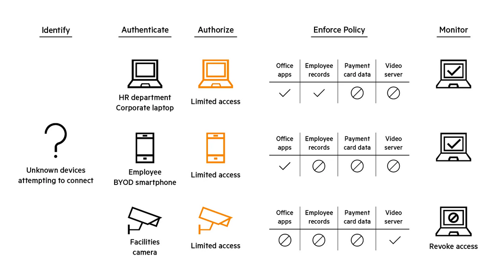
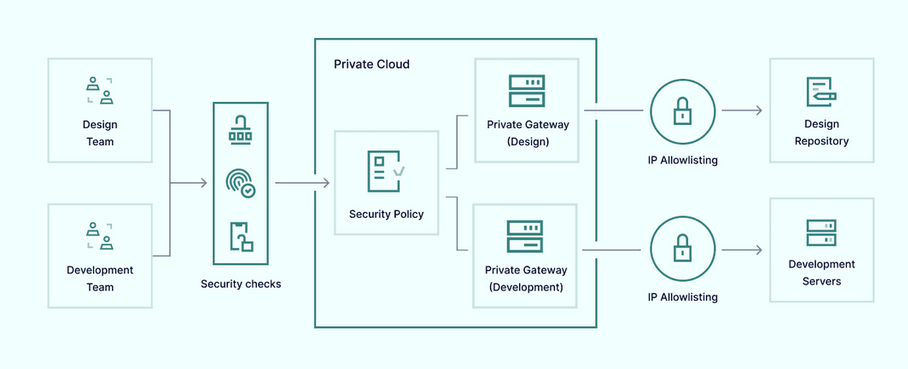
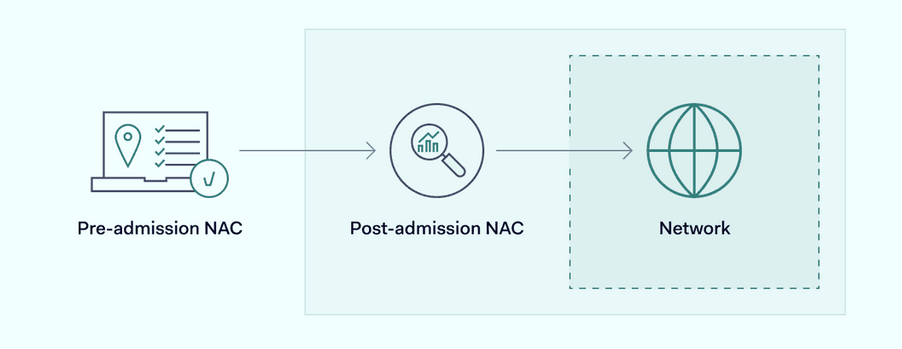
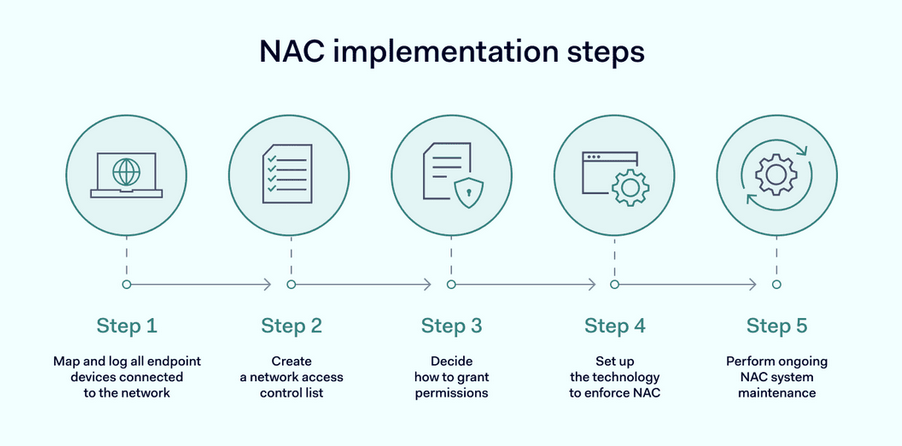

# NAC

> Đây là tổng hợp kiến thức về Network Access Control (NAC)

---

## Định nghĩa Network Access Control (NAC) ? (What)

Network Access Control (NAC) cho phép những doanh nghiệp kiểm soát ai và cái gì kết nối đến mạng của họ. NAC là một công cụ quan trong đối với IT Teams để quản lý và xác minhh tất cả người dùng và thiết bị, đảm bảo mạng của họ được bảo vệ khỏi sự truy cập trái phép.

  

> **Network Access Control nghĩa là** : là một giải giải pháp bảo mật nhằm hạn chế quyền truy cập vào các mạng riêng và các tài nguyên nhạy cảm. Nó thực thi các chính sách đã được cấu hình lên các endpoint để đảm bảo rằng chi những người dùng và thiết bị tuân thủ và được ủy quyền mới được cho phép truy cập vào mạng.

## NAC Elements ?

| Khả năng (Capabilities) | Chức năng (Function)                                                                 | Công nghệ (Technologies)                                                                                                                                 |
|--------------------------|--------------------------------------------------------------------------------------|----------------------------------------------------------------------------------------------------------------------------------------------------------|
| Hiển thị (Visibility)    | Biết được ai và thiết bị nào đang tồn tại trên mạng tại mọi thời điểm.              | Thu thập dữ liệu vật lý hoặc ảo; chủ động (NMAP, WMI, SNMP, SSH) và bị động (SPAN, DHCP, NetFlow/S-Flow/IPFIX); phân tích thiết bị bằng AI/ML; kiểm tra sâu gói tin (DPI) |
| Xác thực (Authentication) | Đảm bảo chắc chắn người dùng hoặc thiết bị đúng là đối tượng mà họ khai báo.        | Xác thực 802.1X; EAP-TLS; RADIUS; TACACS+; xác thực đa yếu tố (MFA); chứng chỉ (certificates)                                                           |
| Định nghĩa chính sách (Policy Definition) | Đặt ra các quy tắc cho người dùng và thiết bị về việc họ được truy cập tài nguyên nào và truy cập như thế nào. | Công cụ tạo rule với các yếu tố như: vai trò, loại thiết bị, phương thức xác thực, tình trạng thiết bị, lưu lượng mạng, vị trí và thời gian truy cập |
| Phân quyền (Authorization) | Xác định quyền truy cập phù hợp cho người dùng hoặc thiết bị sau khi đã xác thực. |                                                                                                                                                   |
| Thực thi (Enforcement)   | Cho phép, từ chối hoặc thu hồi quyền truy cập của người dùng/thiết bị dựa trên chính sách. | Tích hợp và giao tiếp hai chiều với firewall và các công cụ bảo mật khác                                                                                 |

## Tại sao NAC quan trọng ? (Why)

- **Security** -  NAC kiểm soát truy cập mạng và bảo vệ tài nguyên khỏi bị can thiệp và đánh cắp bởi các tác nhân độc hại. Giải pháp NAC đảm bảo rằng chỉ những người dùng và thiết bị được cấp quyền phù hợp mới có thể truy cập mạng và các tài nguyên tương ứng. Hơn nữa, một số giải pháp NAC có thể xác định các dối tượng đang tham gia vào một cuộc tấn công và NAC sẽ cách ly hoặc chặn quyền truy cập cảu đối tượng đố để chờ điều tra thêm. CHức năng này có thể ngăn chặn sự lây lan của các cuộc tấn công.

- **Privacy** - Các tổ chức, công ty đang quản lý khôi lượng và chủng loại dữ liệu lớn hơn bao giờ hết. Một số dữ liệu này nhạy cảm hoặc bí mật. Các giải pháp kiểm soát truy cập mạng cho phép các tổ chức xác định ai, cái gì, kho nào, và bằng cách nào có thể trruy cập được dữ liệu trên mạng, để giảm nguy cơ bị xâm nhập.

- **Compliance** - Các tổ chức, công ty được quản lý thường cần tuân thủ các quy định về bảo mật và bảo vệ dữ liệu, chẳng hạn như Quy định chung về bảo vệ dữ liệu (GDPR), Đạo luật về tính khả chuyển và trách nhiệm giải trình bảo hiểm y tế (HIPAA) và Đạo luật Sarbanes-Oxley (SOX). Các giải pháp của NAC có thể giúp các tổ chức tuân thủ các quy định này bằng cách hạn chế quyền truy cập dữ liệu, giữ cho lưu lượng truy cập an toàn và tách biệt, đồng thời cung cấp nhật ký và báo cáo cho các cuộc kiểm toán.

## NAC hoạt động như thế nào ? (How)

Các giải pháp NAC xác định thiết bị và người dùng nào có thể kết nối với mạng có dây và không dây. Nhóm bảo mật xây dựng một giao thức làm cơ sở cho các chính sách ủy quyền, và phần mềm chuyên dụng sẽ áp dụng các giao thức đó mỗi khi nhận được yêu cầu kết nối.

  

Hệ thống NAC (Network Attached Access Control) tham chiếu đến các dịch vụ xác thực của bên thứ ba khi chúng nhận yêu cầu truy cập và thiết lập quyền người dùng. Hệ thống này xác thực người dùng và tạo ra các kết nối an toàn tương tự như các đường hầm mạng riêng ảo (VPN) truyền thống.

Các công cụ NAC cũng có thể xác định tài nguyên nào khả dụng cho người dùng mạng doanh nghiệp. Chính sách bảo mật có thể thiết lập các cấp độ truy cập khác nhau tùy thuộc vào vai trò người dùng, và phần mềm NAC có thể ngăn người dùng vượt quá quyền hạn được phân bổ.

Kiến trúc này cung cấp nhiều khả năng cho người quản lý mạng, giúp việc quản lý mối đe dọa trở nên dễ dàng hơn nhiều.

## NAC có những ưu điểm chính gì ? 

Vì kiểm soát truy cập mạng cung cấp các biện pháp kiểm soát bảo mật nâng cao, khả năng truy cập theo ngữ cảnh và thực thi ở cấp độ mạng, giải pháp này hoàn toàn phù hợp để giảm thiểu các mối đe dọa và bảo vệ tài nguyên mạng.

- **Increased network visibility** : Sự mở rộng của làm việc từ xa, sử dụng thiết bị cá nhân (BYOD), hợp tác với bên thứ ba và kết nối IoT đặt ra những vấn đề nghiêm trọng cho các nhà quản lý mạng. Sự gia tăng số lượng thiết bị và người dùng khiến việc lập bản đồ và giám sát trở nên khó khăn, làm cho khả năng hiển thị mạng hoàn chỉnh trở nên thách thức. Các giải pháp NAC giải quyết vấn đề này bằng cách lập bản đồ mọi thiết bị kết nối với cơ sở hạ tầng mạng và triển khai các chính sách bao gồm mọi người dùng được ủy quyền.

- **Improved cybersecurity** : Mối đe dọa từ các cuộc tấn công mạng ngày càng gia tăng. Tài nguyên của doanh nghiệp bị phơi nhiễm với phần mềm độc hại, mã độc tống tiền và các cuộc tấn công DDoS, trong khi tin tặc liên tục tìm cách truy cập vào dữ liệu nhạy cảm mà chúng có thể bán trên dark web. Các giải pháp NAC giảm thiểu những mối đe dọa này bằng cách loại trừ các tác nhân trái phép hoặc đáng ngờ và hạn chế khả năng truy cập mạng của người dùng.
- **More effective compliance** : Các cơ quan quản lý đang trở nên nghiêm ngặt hơn về cách các công ty bảo vệ thông tin khách hàng, đặc biệt là liên quan đến thông tin thanh toán và thông tin cá nhân. Các công ty có hồ sơ tuân thủ các quy định bảo mật vững chắc sẽ được hưởng lợi từ sự tin tưởng và giảm rủi ro tổn thất liên quan đến việc đánh cắp dữ liệu. Các giải pháp NAC có thể hỗ trợ cả hai nhiệm vụ bằng cách tuân thủ các tiêu chuẩn bảo mật vàng trên tất cả các điểm cuối mạng.

- **Cost savings** : Việc triển khai NAC dẫn đến tiết kiệm chi phí đáng kể cho các tổ chức. Theo dõi và bảo vệ thiết bị tự động giảm nhu cầu về nguồn lực CNTT rộng lớn, cho phép nhóm của bạn tập trung vào các nhiệm vụ chiến lược hơn. Bằng cách chặn truy cập trái phép và ngăn chặn các cuộc tấn công phần mềm độc hại, các giải pháp NAC giúp tránh các tổn thất tài chính liên quan đến vi phạm dữ liệu và thời gian ngừng hoạt động, đảm bảo tư thế an ninh mạng hiệu quả hơn về chi phí.

- **Ease of control** : Các giải pháp NAC đơn giản hóa việc quản lý mạng với các tính năng hiển thị nâng cao. Giám sát thời gian thực này hỗ trợ các nhóm CNTT trong việc giám sát quyền truy cập mạng, đảm bảo chỉ các thiết bị và người dùng tuân thủ mới được kết nối. Ngoài ra, NAC tạo điều kiện thuận lợi cho việc quản lý vòng đời, giúp dễ dàng loại bỏ hoặc thay thế thiết bị, do đó duy trì một môi trường mạng hợp lý và an toàn.

## Các khả năng của NAC

Kiểm soát truy cập mạng (NAC) đảm bảo quyền truy cập được ủy quyền vào các tài nguyên mạng, từ đó bảo vệ chống lại sự truy cập trái phép của người dùng. Điều này cung cấp một loạt các khả năng để thực thi các chính sách bảo mật mạng, xác thực và ủy quyền người dùng, cũng như giám sát và kiểm soát hoạt động mạng.

- **Total network visibility** : Việc triển khai NAC giúp các nhà quản lý mạng doanh nghiệp dễ dàng theo dõi mạng hơn. Các nhóm bảo mật có thể lập bản đồ các thiết bị được kết nối và phạm vi của mạng. Họ có thể xác định các mối đe dọa và thực hiện các hành động giảm thiểu dựa trên thông tin này trước khi chúng gây ra bất kỳ thiệt hại nào.

- **Instant user profiling** : Khi người dùng yêu cầu truy cập từ xa vào các cổng NAC, hệ thống sẽ ngay lập tức kiểm tra thông tin đăng nhập của họ. Phần mềm NAC có thể loại trừ các thiết bị và cá nhân không xác định bằng cách so sánh dữ liệu này với các tài nguyên được lưu trữ tập trung.

- **Guest networking management** : Các giải pháp kiểm soát truy cập mạng cũng cho phép các công ty cho phép người dùng khách truy cập một cách an toàn với quyền truy cập mạng hạn chế. Quyền truy cập khách an toàn cho phép cộng tác với các đối tác và nhà thầu đồng thời giảm thiểu các mối đe dọa an ninh trong mạng lưới doanh nghiệp.

- **Internal access management** : Khi mạng lưới doanh nghiệp cấp quyền truy cập cho người dùng, các công cụ NAC sẽ xác định những gì họ có thể làm. Các tài nguyên nhạy cảm như cơ sở dữ liệu khách hàng có thể được bảo vệ khỏi người dùng trái phép. Các tác nhân độc hại cũng sẽ gặp khó khăn trong việc di chuyển ngang qua mạng, hạn chế nguy cơ tấn công phần mềm độc hại.

- **Network management** : Đôi khi, các công cụ NAC có thể hỗ trợ các tác vụ quản lý mạng như cân bằng tải và phân bổ tài nguyên. Việc cập nhật các chính sách truy cập cũng khuyến khích việc giám sát giao thức thường xuyên, thúc đẩy các nhóm bảo mật cập nhật chiến lược truy cập.

## Các trường hợp sử dụng NAC ? 

Kiểm soát truy cập mạng rất hữu ích trong nhiều trường hợp sử dụng, giúp tăng cường khả năng hiển thị mạng, thực thi các chính sách bảo mật và bảo vệ chống lại sự truy cập trái phép. Dưới đây là một số trường hợp sử dụng phổ biến của nó.

- **NAC for managing BYOD work arrangements** : Làm việc từ xa, sử dụng thiết bị di động và chính sách "mang thiết bị cá nhân đến nơi làm việc" (BYOD) ngày càng phổ biến trong những năm gần đây. Điều này rất tốt cho sự linh hoạt trong làm việc và hợp tác, nhưng cũng tiềm ẩn nguy cơ mở rộng bề mặt tấn công và các vấn đề quản lý mạng. NAC cho phép các nhóm bảo mật ghi lại thông tin xác thực BYOD và chỉ cho phép các thiết bị đã được xác thực truy cập tài nguyên.

- **NAC for safe collaboration with corporate partners** : Làm việc với các nhà thầu, khách mời và đối tác bên ngoài là một phần thường xuyên của công việc hiện đại. Tuy nhiên, các vấn đề về bảo mật mạng có thể phát sinh khi bạn cho phép bên thứ ba truy cập vào tài nguyên của công ty. Giải pháp NAC giải quyết vấn đề này bằng cách ủy quyền cho các bên thứ ba muốn truy cập dữ liệu của bạn, cho phép cộng tác hiệu quả mà không gây ra rủi ro không đáng có.

- **NAC for incident response** : Khi các cuộc tấn công mạng xảy ra, NAC có thể nhanh chóng vào cuộc. Các công ty có thể thiết lập các ứng dụng NAC để cung cấp dữ liệu phản hồi mối đe dọa cho các đối tác bảo mật bên thứ ba, tạo điều kiện thuận lợi cho các biện pháp giảm thiểu ngay lập tức. Bất kỳ điểm cuối nào bị ảnh hưởng bởi các cuộc tấn công đều có thể bị vô hiệu hóa và cách ly, và việc di chuyển ngang trong mạng có thể bị hạn chế.

- **NAC for handling IoT devices and systems** : Internet vạn vật (IoT) đã trở thành một công cụ thiết yếu cho các công ty trong nhiều lĩnh vực khác nhau. Các thiết bị IoT như thiết bị tự động hóa, cảm biến, lưới điện thông minh, và thậm chí cả các đội xe kết nối IoT đều được đề cập. Giải pháp NAC có thể kết nối một lượng lớn thiết bị IoT một cách an toàn và có hệ thống, đảm bảo không có thiết bị nào không được lập bản đồ - điều này cũng áp dụng cho sự gia tăng các thiết bị y tế được kết nối với IoT. Luồng dữ liệu nhạy cảm có thể được điều chỉnh và bảo vệ thông qua các giải pháp NAC thích ứng.

- **NAC for security compliance** : Giải pháp NAC cũng là một công cụ hữu ích để đảm bảo tuân thủ các quy định an ninh mạng có liên quan. Các chính sách an ninh mạng có thể được tích hợp vào các kế hoạch tuân thủ GDPR hoặc HIPAA, chứng minh rằng mạng lưới đáp ứng các tiêu chuẩn bên ngoài.

- **NAC for medical devices** : Với số lượng thiết bị y tế kết nối mạng ngày càng tăng, việc xác định và quản lý chúng một cách hiệu quả là vô cùng cần thiết. Bằng cách thực thi các chính sách truy cập nghiêm ngặt, NAC đảm bảo chỉ những thiết bị được ủy quyền mới có thể kết nối với mạng, từ đó tăng cường an ninh y tế và củng cố khả năng phòng chống các cuộc tấn công mã độc tống tiền. Cách tiếp cận toàn diện này giúp duy trì tính toàn vẹn của hệ thống y tế, đảm bảo hoạt động liên tục và an toàn của các dịch vụ chăm sóc sức khỏe.

## Các loại NAC ? 

Có rất nhiều gói giải pháp NAC và vô số cách cấu hình chúng. Tuy nhiên, việc chia chúng thành hai loại chính sẽ giúp đơn giản hóa mọi thứ.

  

- **Pre-admission** : Công nghệ NAC trước khi truy cập đánh giá, xác thực và cho phép người dùng kết nối với mạng lưới doanh nghiệp. Tất cả diễn ra trước khi người dùng có quyền truy cập. Hệ thống này lưu trữ thông tin đăng nhập của người dùng trên các cơ sở dữ liệu bảo mật, và các giao thức truy cập quy định các yêu cầu mà thiết bị cần đáp ứng trước khi được phép truy cập. Các dịch vụ xác thực của bên thứ ba thường cũng được sử dụng để cung cấp thêm sự đảm bảo thông qua xác thực đa yếu tố (MFA).

- **Post-admission** : NAC sau khi cấp quyền truy cập có một chút khác biệt. Trong trường hợp này, xác thực trước khi cấp quyền truy cập có thể vẫn được duy trì. Tuy nhiên, cơ sở hạ tầng an ninh mạng sau khi cấp quyền truy cập sẽ giám sát những gì người dùng có thể làm sau khi họ truy cập vào tài nguyên của công ty. Tường lửa nội bộ phân tách tài nguyên mạng, trong khi các giao thức bảo mật đảm bảo người dùng chỉ truy cập dữ liệu tương ứng với quyền hạn của họ. Khi các thiết bị đầu cuối cố gắng vượt quá các quyền đó, hệ thống NAC sau khi cấp quyền truy cập sẽ ngăn chặn chúng và từ chối quyền truy cập.

## Làm sao để triển khai NAC ? 

  

Các phương pháp triển khai khác nhau tùy thuộc vào cấu trúc của từng mạng, số lượng thiết bị IoT, thiết bị y tế và thiết bị của bên thứ ba tham gia, ngân sách của công ty và quyết định lựa chọn giải pháp bảo mật mạng trước khi truy cập, sau khi truy cập hoặc giải pháp kết hợp. Tuy nhiên, một số bước cơ bản là phổ biến đối với hầu hết các ứng dụng kiểm soát truy cập mạng (NAC).

- **Security teams should map and log all endpoint devices connected to the network** : Thực hiện khảo sát toàn diện các điểm cuối của mạng, xem xét các thiết bị IoT, thiết bị của nhân viên như máy tính xách tay và thiết bị tập trung.

- **Security teams need to create a network access control list** : Danh sách này bao gồm chi tiết của tất cả người dùng được ủy quyền, cùng với mức độ truy cập được cho phép của họ. Bắt đầu bằng cách ghi lại tất cả danh tính người dùng vào cơ sở dữ liệu trung tâm. Sử dụng thư mục mạng hiện có thường là cơ sở vững chắc cho giai đoạn này.

- **Decide how to grant permissions to authorized users** : Việc thiết lập quyền theo vai trò thay vì riêng lẻ sẽ tiết kiệm thời gian và đơn giản hóa quy trình. Cố gắng áp dụng nguyên tắc đặc quyền tối thiểu (PYOP) bất cứ khi nào có thể. PYOP có nghĩa là cho phép người dùng truy cập những gì họ cần trong khi hạn chế mọi thứ khác.

- **Set up the technology required to implement your access control list** : Thiết lập công nghệ cần thiết để triển khai danh sách kiểm soát truy cập của bạn. Kiểm tra cổng truy cập để đảm bảo người dùng có thẩm quyền có thể truy cập và hệ thống loại trừ người dùng trái phép.

- **Create and maintain systems to update the NAC system as required** : Tạo và duy trì hệ thống để cập nhật hệ thống NAC khi cần thiết. Danh sách kiểm soát truy cập sẽ thay đổi khi cấu trúc mạng doanh nghiệp thay đổi. Các ứng dụng sẽ cần được cập nhật thường xuyên để đảm bảo công nghệ chống virus, kiểm soát truy cập và mã hóa luôn được cập nhật.

Thực hiện theo các bước này sẽ cho phép các công ty tạo ra hệ thống truy cập mạng an toàn với kiểm soát truy cập mạng. Tuy nhiên, việc tự làm như vậy thường không khôn ngoan hoặc cần thiết. Nhiều nhà cung cấp NAC có thể cung cấp chuyên môn và công nghệ để phát triển các giải pháp bảo mật mạng tùy chỉnh với các chính sách bảo mật được khuyến nghị.