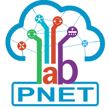
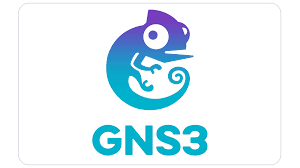
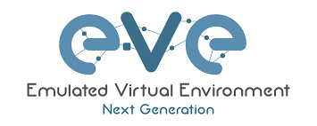
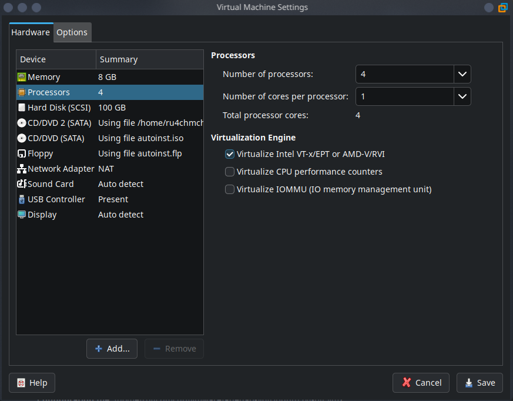
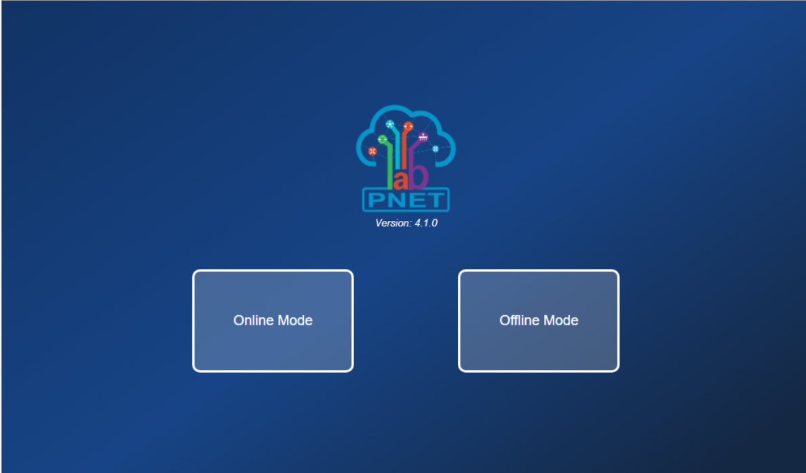
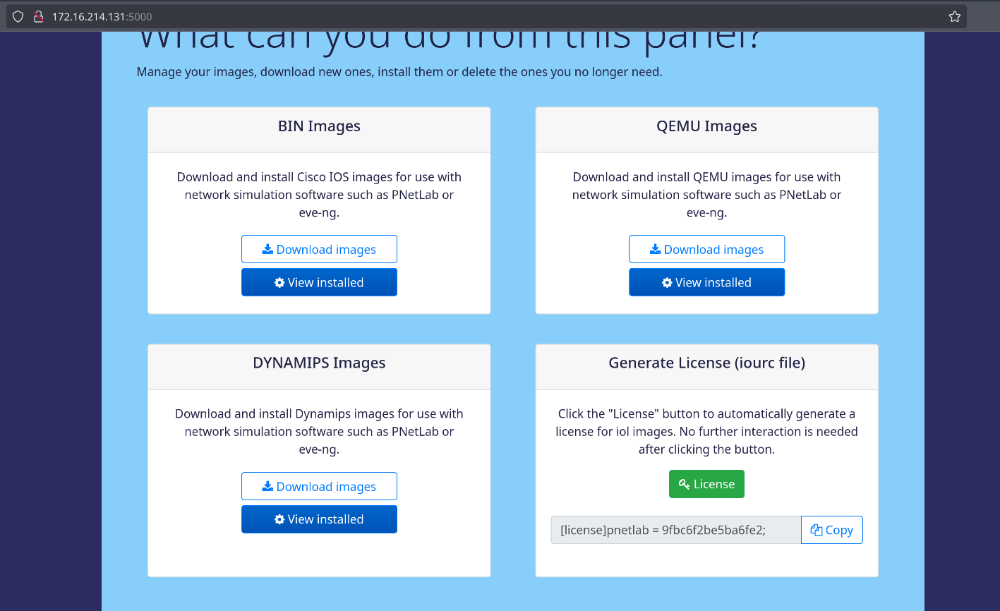
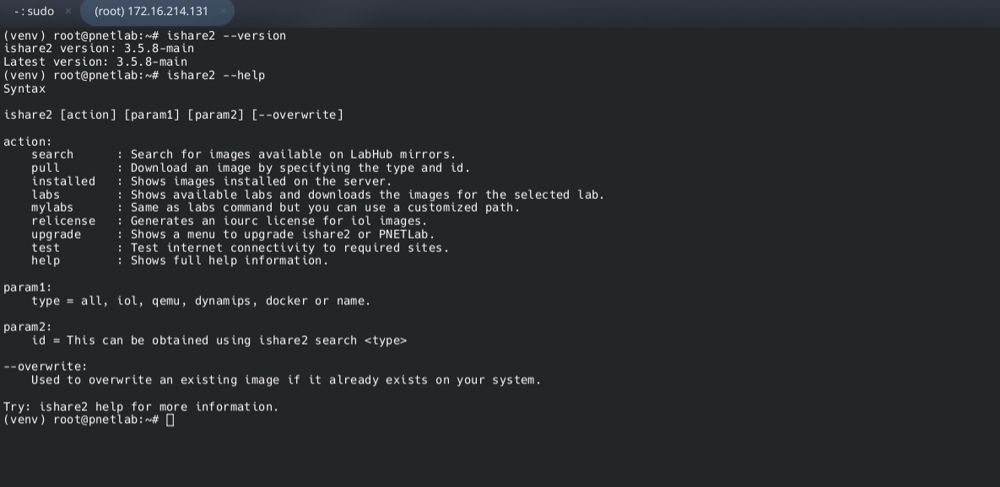
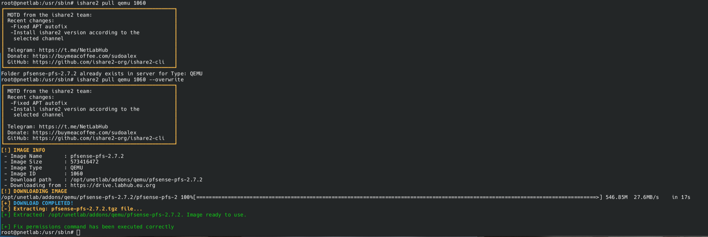

# Network-Emulation-Laboratory

> Đây là branch hướng dẫn về phần mềm PNETlab dùng để ảo hóa thiết bị mạng để tạo ra các lab cơ bản và nâng cao, phục vụ cho mục đích học tập và giới thiệu tool Ishare2 dùng để pull các image để ảo hóa các thiết bị mạng.

---

## Mục Lục

- [Network-Emulation-Laboratory](#-network-emulation-laboratory)
  - [Mục Lục](#-mục-lục)
  - [PNETlab vs GNS3 EVE-NG](#-pnetlab-vs-gns3-eve-ng)
    - [PNETlab là gì?](#-pnetlab-là-gì)
    - [GNS3 là gì?](#-gns3-là-gì)
    - [EVE-NG là gì?](#-eve-ng-là-gì)
  - [So sánh PNETlab vs GNS3 vs EVE-NG](#-so-sánh-pnetlab-vs-gns3-vs-eve-ng)
  - [Tải File Cần Thiết](#-tải-file-cần-thiết)
  - [Hướng Dẫn Cài Đặt](#-hướng-dẫn-cài-đặt)
    - [Yêu Cầu Hệ Thống](#-yêu-cầu-hệ-thống)
    - [Cài Đặt với PNETlab](#-cài-đặt-với-pnetlab)
      - [Các bước cài đặt PNETlab\_v6](#các-bước-cài-đặt-pnetlab_v6)
    - [Cài đặt tool Ishare2](#-cài-đặt-tool-ishare2)
      - [Hướng dẫn cài Ishare2 GUI và CLI](#hướng-dẫn-cài-ishare2-gui-và-cli)
        - [Ishare2 GUI](#ishare2-gui)
        - [Ishare2 CLI](#ishare2-cli)

---

## PNETlab vs GNS3 EVE-NG

### PNETlab là gì?

- **PNETlab (Private Network Emulator Toolkit Lab)** là một nền tảng mô phỏng mạng dựa trên web, tương tự như EVE-NG, giúp người dùng dễ dàng triển khai, cấu hình và mô phỏng các thiết bị mạng trong môi trường ảo.
<p align="center">
  
</p>
> **Ứng dụng phổ biến:** PNETLab được phát triển dựa trên EVE-NG Community nhưng cải tiến mạnh về giao diện, hiệu năng và trải nghiệm người dùng để có thể làm lab, thử nghiệm, học tập.

> **Tính năng nổi bật:**
>
> - Giao diện Web hiện đại, dễ sử dụng
> - Hỗ trợ nhiều thiết bị: Cisco, Juniper, Palo Alto, Docker,...
> - Không cần client riêng, chạy hoàn toàn qua trình duyệt
> - Miễn phí hoàn toàn (bao gồm team mode)
> - Tích hợp sẵn Wireshark (qua browser)

---

### GNS3 là gì?

- **GNS3 (Graphical Network Simulator-3)** là phần mềm mô phỏng mạng dành cho desktop, thường dùng để xây dựng lab học CCNA, CCNP,... trên Windows/Linux/macOS.

<p align="center">
  
</p>
> GNS3 hỗ trợ giao diện đồ họa trên desktop và kết nối với server để mở rộng hiệu năng lab.

> **Tính năng nổi bật:**
>
> - Hỗ trợ Dynamips, IOU, QEMU, Docker
> - Giao diện kéo/thả dễ dùng
> - Tích hợp trực tiếp với thiết bị thật (bridge network)
> - Phù hợp với các lab nhỏ đến trung bình
> - Hoàn toàn miễn phí và mã nguồn mở

---

### EVE-NG là gì?

- **EVE-NG (Emulated Virtual Environment Next Generation)** là một nền tảng mô phỏng mạng doanh nghiệp mạnh mẽ, được sử dụng rộng rãi trong môi trường chuyên nghiệp và đào tạo nâng cao.
<p align="center">
  
</p>
> EVE-NG có cả phiên bản Community miễn phí và bản Pro (có tính năng team-work, tab riêng,...).

> **Tính năng nổi bật:**
>
> - Giao diện Web hoàn chỉnh (100% browser)
> - Hỗ trợ hàng trăm loại thiết bị ảo (Cisco, Juniper, Fortinet, F5,...)
> - Quản lý lab theo template, hỗ trợ snapshot, lab sharing
> - Tối ưu cho doanh nghiệp, trung tâm đào tạo
> - Có bản trả phí (EVE-NG Pro) với nhiều tính năng nâng cao

---

## So sánh PNETlab vs GNS3 vs EVE-NG

| **Tiêu chí**                        | **PNETLab**                        | **GNS3**                            | **EVE-NG**                          |
|------------------------------------|--------------------------------------|----------------------------------------|----------------------------------------|
| **Loại nền tảng**                  | Web-based (ứng dụng web)             | Desktop + server (có GUI client)       | Web-based                               |
| **Hệ điều hành host**              | Linux (Ubuntu), cài như ISO hoặc VM  | Windows / macOS / Linux                | Linux (Ubuntu/Debian), cài như ISO/VM  |
| **Cài đặt & triển khai**           | Dễ dàng, cài như máy ảo hoặc ISO     | Phức tạp hơn (client/server)           | Trung bình (ISO/VM), yêu cầu Linux      |
| **Giao diện người dùng**           | Web GUI hiện đại, dễ dùng            | Desktop GUI (Qt)                       | Web GUI, khá cũ nhưng ổn định           |
| **Hiệu năng**                      | Tốt (nếu cấu hình hợp lý)            | Tốt trên local hoặc server riêng       | Tốt, mạnh mẽ trên máy chủ               |
| **Thiết bị hỗ trợ**                | QEMU, IOU, Dynamips, Docker          | QEMU, IOU, Dynamips, Docker            | QEMU, IOU, Docker                        |
| **Hỗ trợ Docker container**        | Có sẵn                             | Có (cần cấu hình)                    | Có                                    |
| **Hỗ trợ snapshot/lab backup**     | Có, dễ sử dụng                     | Có (thủ công hơn)                    | Có                                    |
| **Chạy được trên trình duyệt?**    | 100% Web                           | Không (chỉ GUI client)              | 100% Web                              |
| **Học CCNA/CCNP/Firewall phù hợp?**| Rất phù hợp                        | Phù hợp                              | ✅ Rất phù hợp                           |
| **Tính năng drag & drop**          | Có (mượt mà)                       | Có                                   | Có                                    |
| **Yêu cầu tài nguyên**             | Trung bình                           | Thấp đến trung bình                    | Trung bình đến cao                      |
| **Khả năng cộng tác/lab nhóm**     | Có (phiên bản team)               | Không chính thức                    | Có (phiên bản pro)                   |
| **Chi phí**                        | Miễn phí hoàn toàn                 | Miễn phí                             | Miễn phí bản community, Pro trả phí  |
| **Dễ học đối với người mới**       | Dễ nhất                            | Trung bình                              | Trung bình - khó hơn PNETLab            |

---

## Tải File Cần Thiết

- [PNETlab](https://drive.labhub.eu.org/0:/OVA/PNetLab/)
- [GNS3](https://www.gns3.com/software/download)
- [EVE-NG](https://www.eve-ng.net/index.php/download/)

---

## Hướng Dẫn Cài Đặt

### Yêu Cầu Hệ Thống

- CPU hỗ trợ ảo hóa (Intel VT-x / AMD-V)
- RAM: Tối thiểu 8GB (khuyến nghị 16GB)
- Dung lượng ổ cứng trống ≥ 100GB
- File cài đặt: `.iso` hoặc `.ova`

---

### Cài Đặt với PNETlab

- **Do mình chỉ sử dụng PNETlab nên mình sẽ hướng dẫn về PNETlab**

> **OVA**: Thông thường với đường link ở trên bạn sẽ cài đặt được PNETlab bằng cách import file OVA vào máy ảo VMware Workstation Pro hoặc Proxmox VE 8 nhưng phiên bản chỉ có thể cài từ 4.2.10 - 5.3.13 mà thôi nếu ai chỉ muốn dùng các phiên bản ấy thì cứ import và dùng bth, tiện đây, mình sẽ hướng dẫn các bạn cài theo hướng manual để được phiên bản mới nhất.
>
> **Linux**: Vì PNETlab_v6 chỉ chạy trên ubuntu phiên bản 20 (Focal) nên mình sẽ cài bản đó và hướng dẫn step-by-step.

#### Các bước cài đặt PNETlab_v6

1. **Tải Ubuntu Focal:** Các bạn nên cài bản Ubuntu-Server thay vì Ubuntu-desktop vì nó nhẹ hơn và thích hợp hơn cho PNETlab.

   - [Ubuntu-Server-20.04.6](https://releases.ubuntu.com/focal/)  

2. **Bật Virtualize Intel VT-x/EPT or AMD-v/RVI:** vì nếu không bật chế độ ảo hóa của thì PNETlab sẽ không thể hoạt động.

   

3. Tải & Cài đặt Script PNETLab v6

- Sau khi đã khởi chạy **Ubuntu Server**, bạn thực hiện theo các bước sau  
*(nên chuyển sang quyền root bằng `sudo su` để tránh lỗi phân quyền)*:

- Cập nhật hệ thống:

```bash
sudo apt update && sudo apt upgrade -y
```

- Tải file cài đặt PNETLab v6:
  
```bash
wget https://drive.labhub.eu.org/0:/upgrades_pnetlab/Focal/install_pnetlab_v6.sh
```

- Cấp quyền thực thi cho script:

```bash
chmod +x install_pnetlab_v6.sh
```

- Chạy script cài đặt:

```bash
sudo bash install_pnetlab_v6.sh
```

- Sau khi hoàn thành script thì nó sẽ hiện ra root/pnet (user/password) để login sau khi `reboot`, khi reboot vô thì giao diện sẽ đổi lại giống các file OVA mà bạn cài như trên.
- Khi đăng nhậu user và password thì nó sẽ cho địa chỉ ip, khi truy cập vào web thì sẽ hiện ra trang PNETlab và nên dùng mode offline nghe!
  
  

- [PNETlab Documentation](https://www.pnetlab.com/pages/download) nếu muốn đọc hiểu thêm.

### Cài đặt tool Ishare2

#### Hướng dẫn cài Ishare2 GUI và CLI

- Thì bình thường mọi người dùng cách thêm image bằng việc kéo thả với WinSCP nhưng hiện nay mình mới phát hiện ra tool Ishare2 này, có thể chạy bằng GUI và CLI, chỉ với 1 câu lệnh hoặc click chuột là có thể download image về, rất là thuận tiện. Sau đây mình sẽ để 2 đường link repo GUI and CLI, trong đó có hướng dẫn cài, bạn nào thấy thuận tiện cái nào thì dùng cái đó.
  
##### Ishare2 GUI

- [GUI Download](https://github.com/ishare2-org/ishare2-web-gui)
- Sau khi cài thành công thì nó sẽ cho mình địa chỉ 0.0.0.0 với cồng :5000 thì mình nhập ip của pnetlab với cổng 5000 đó ví dụ như: `172.16.214.131:5000`.
- nếu ai muốn chạy với uvicorn mà k phải `python3 main.py` thì chỉnh lại một tí như sau: `uvicorn main:app --reload --host 0.0.0.0 --port 8000`, sau đó nhập địa chỉ ip pnet với công 8000, ví dụ như: `172.16.214.131:8000`
  


##### Ishare2 CLI



- [CLI Download](https://github.com/ishare2-org/ishare2-cli) Khi cài nhớ chọn channel download là `Google Drive` nghe đừng chọn cái `default`.
- Nếu khi cài đặt xong mà download image bị lỗi `erros` thì chúng ta run lại lệnh `ishare2 config`để config lại và thử pull image về coi, nếu lỗi thì chúng ta phải xóa thư mục CLI cũ đi: `rm -rf /opt/ishare2/CLI/` và `wget -O /usr/sbin/ishare2 https://raw.githubusercontent.com/ishare2-org/ishare2-cli/main/ishare2 && chmod +x /usr/sbin/ishare2 && ishare2`, sau đó thử lại, hoặc chúng ta đổi channel sang default thay vì google drive nha , nếu k đc nữa thì dùng cái GUI, còn k đc nữa thì đưa t fix cho.
- Một cái nữa là khi cài lỗi thì mình cài lại lần nữa nó hiện already exist thì mình thêm `--overwrite` nghe.

