# Vmware-NSX

## Lý thuyết

### 1. Tìm hiểu định nghĩa, kiến trúc NSX

#### a. NSX là gì ?
**NSX** là một nên tảng `SDN` & Security giúp ảo hóa hoàn toàn mạng và bảo mật, đưa tất cả các tính năng của switching, routing, firewall, load balancer, IDS/IPS, ... vào phần mềm, chỉ cần cấu hình thông qua phần mềm và nó sẽ tự triển khai toàn bộ hạ tầng.

  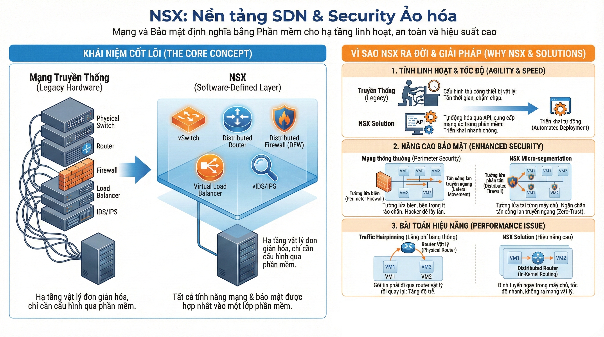

Vì sao `NSX` ra đời, nó giải quyết được vấn đề gì ?
- Tính linh hoạt, tốc độ triển khai mạng nhanh :
    - Tách biệt chức năng mạng & bảo mật ra khỏi phần cứng, cho phép cung cấp mạng ảo trong phần mềm, tự động hóa cấu hình mạng và bảo mật thông qua API nhanh hơn thay vì phải cấu hình thiết bị vật lý tốn thời gian.
- Nâng cao bảo mật : 
    - Thì ở kiến trúc mạng thông thường thì chúng ta đặt tưởng lửa ở biên nhưng một khi hacker lọt qua được cửa chính thì chúng có thể tự do nhảy từ máy chủ này sang máy chủ khác trong mạng của chúng ta vì bên trong mạng nội bộ rất ít rào chắn. `NSX` giải quyết bằng `Micro-segmentation` cho phép đặt tường lửa phân tán tại các máy chủ, điều này giúp ngăn chặn sự lây lan của các cuộc tấn công bên trong.
- Bài toán hiệu năng : 
    - 2 máy ảo nằm cùng một máy chủ vật lý nhưng thuộc 2 vlan khác nhau, để máy 1 và máy 2 nch được với nhau thì goi tin chạy từ máy 1 phải đi ngược lên switch/router vật lý để định tuyến rồi chạy xún ngược lại máy chủ để vào máy 2. Cái này gọi là `Trafic Hairpinning` gây lãng phí băng thông và tăng độ trễ. Do đó `NSX` giải quyết bằng cách xử lí việc định tuyến ngay trong máy chủ, gói tin đi từ máy 1 sang máy 2 trực tiếp trong bộ nhớ ram của máy chủ, tốc độ nhanh, không cần ra ngoài mạng vật lý.

#### b. Kiến trúc NSX
Kiến trúc **NSX** được thiết kế theo mô hình `SDN` chuẩn mực, tách biệt hoàn toàn 3 lớp chức năng: `Management Plane`, `Control Plane`, và `Data Plane`.

  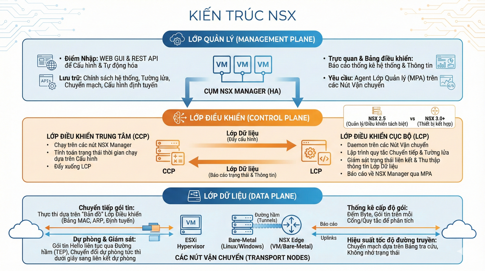

##### Management Plane
Là giao diện trung tâm để người dùng tương tác và cấu hình hệ thống **NSX**, trong đó `NSX Manager` là thành phần quản lý đóng vai trò quan trọng.

  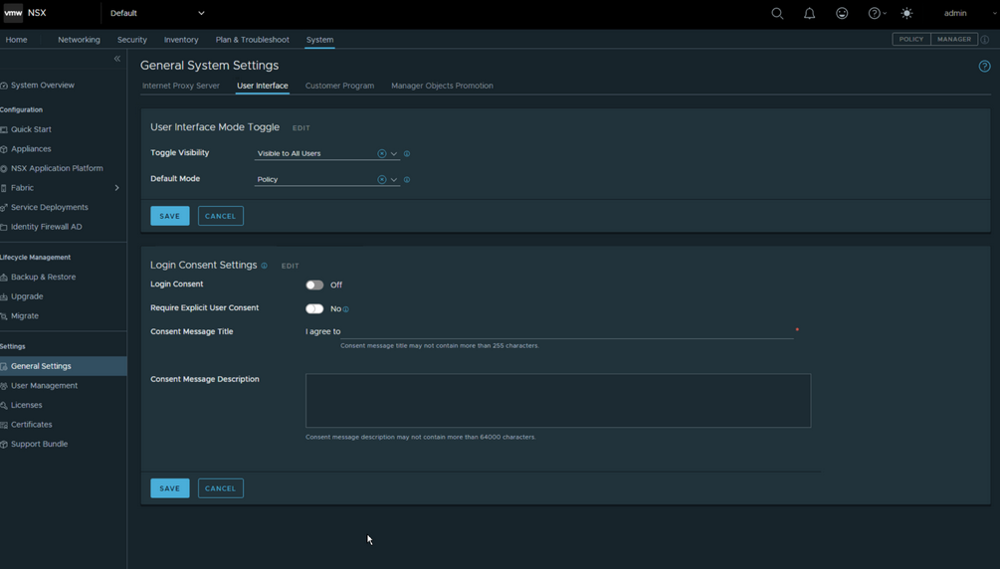

- Đóng vai trò là `Entry Point` để quản trị viên quản lý và cấu hình thông qua WEB GUI hoặc tự động hóa bằng RESTful API.
- Chạy trên một cụm (`Cluster`) gồm 3 máy ảo `NSX Manager` để đảm bảo dự phòng (`HA`).
- `NSX Manager` lưu trữ các cấu hình hệ thống như chính sách, firewall, switching, routing, ... và đẩy cấu hình thực thi xuống `Control Plane`.
- Truy xuất thông tin cấu hình và thông tin hệ thống để thống kê số liệu bằng các Visualize và Dashboard.
- Yêu cầu các `Transport Node` phải được cài đặt và khởi chạy một Agent là `Management Plane Agent` (`MPA`)

##### Control Plane
Là việc điều phối các cấu hình điều khiển từ `Management Plane` xuống `Data Plane` thông qua `Forwarding Engine` và quảng bá lại thông tin mô hình mạng các thành phần trong `Data Plane` cho `NSX Manager`. Trong **NSX**, `Control Plane` được chia làm 2 phần:

- `Central Control Plane` (`CCP`): là những service chạy trên các node `NSX Manager` với nhiệm vụ tính toán một số trạng thái runtime dựa trên cấu hình của `NSX Manager` để đẩy xuống `Local Control Plane`.
- `Local Control Plane` (`LCP`): là những Daemon (chương trình) chạy trên các `Transport Node`, `LCP` chịu trách nhiệm tính toán hoàn chỉnh các trạng thái runtime cấu hình nhận từ `CCP` service và lập trình các hạng mục Forwarding và Firewall rule để đẩy xuống `Data Plane` thông qua `Forwarding Engine` trên `Transport Node`. 

`LCP` Daemon cũng chịu trách nhiệm `Monitor Link Status` và thu thập thông tin từ các thành phần trong `Data Plane` để gửi về lại cho `NSX Manager` thông qua các `Agent MPA`.

  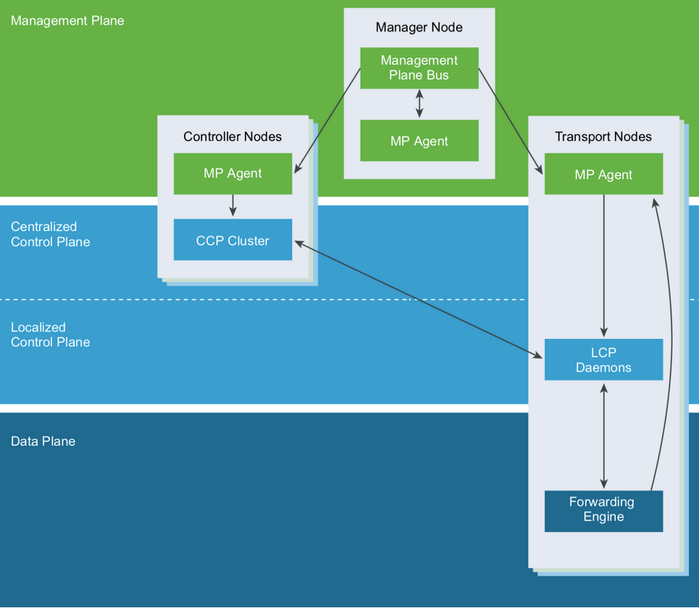

- `NSX Manager` => `CCP` Service => `LCP` Daemon => Hướng đẩy cấu hình từ `Management Plane` xuống `Data Plane`.
- `NSX Manager` => `MPA Agent` => `LCP` Daemon => Hướng quảng bá và trao đổi thông tin liên quan đến mô hình mạng của các `Data Plane` Host.

  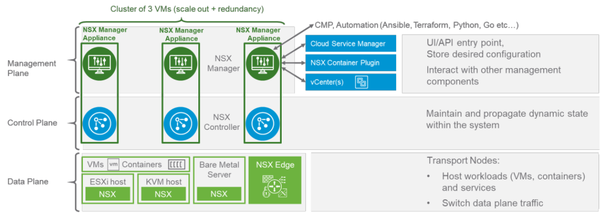

- **NSX** 2.5 trở xuống phân tách `NSX Manager` và `NSX Controller` độc lập với nhau, mô hình chuẩn sẽ bao gồm Cluster 3 `VM-Manager` và Cluster 3 `VM-Controller`. 
- **NSX** 3.0 trở về sau kết hợp cả `NSX Manager` và `Controller` thành `NSX Manager Appliance` để tối ưu thiết kế và hiệu năng, mô hình chuẩn chỉ còn một cụm Cluster 3 `VM NSX Node`.

Mỗi `Appliance` sẽ có một IP riêng biệt và được quản lý chung bằng một `Virtual IP`, các `Appliance` đồng bộ dữ liệu với nhau nhanh chóng và các tác vụ có thể thực hiện trên bất kỳ `Appliance` nào trong `Cluster`.

##### Data Plane
Là việc thực hiện chuyển tiếp các gói tin trong mô hình mạng bằng các thông tin điều khiển từ `Control Plane` đổ xuống. 

  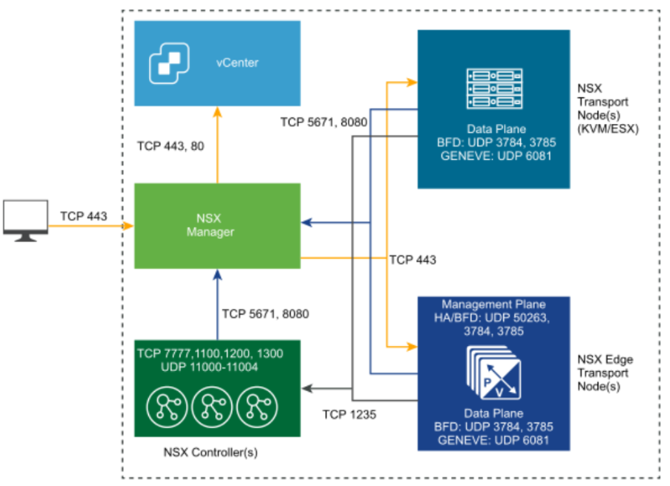

  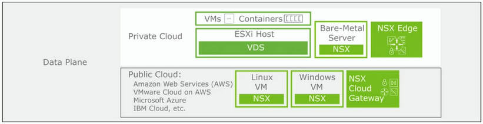

- Chuyển tiếp gói tin theo lệnh : `Control Plane` (`CCP`) đẩy xuống một "Bản đồ" (gồm bảng MAC, bảng ARP, bảng Routing). Data Plane chỉ việc nhìn vào gói tin đến, so sánh với "Bản đồ" này và đẩy đi. Nếu `Control Plane` bảo "IP 10.0.0.1 nằm ở TEP Host B", thì `Data Plane` cứ thế đóng gói và gửi sang Host B, không thắc mắc.

- Báo cáo sơ đồ mạng : Khi một VM mới bật lên (Power on), `Data Plane` phát hiện ra địa chỉ MAC và IP của VM đó và nó lập tức báo cáo ngược lên `Control Plane` (thông qua `LCP`): "Sếp ơi, tôi vừa thấy con VM Web-01 xuất hiện ở cổng vNIC số 3 của tôi". Nhờ đó, `Control Plane` mới cập nhật được bản đồ toàn mạng.

- Giám sát tuyến đường và tự động dự phòng : Giữa các Host ESXi và Edge luôn có các đường hầm (`Tunnel`). `Data Plane` liên tục gửi các gói tin thăm dò (Hello packets) qua lại. Nếu một đường dây cáp bị đứt, `Data Plane` phát hiện ra việc mất tín hiệu chỉ trong vài mili-giây. `Failover`: Ngay lập tức, `Data Plane` tự động chuyển lưu lượng sang đường Uplink dự phòng khác (Backup Link) mà không cần hỏi ý kiến `NSX Manager`. Điều này đảm bảo mạng không bị gián đoạn.

- Thống kê cấp độ gói : Nó đếm chi tiết từng byte, từng gói tin đi qua mỗi cổng, mỗi luật `Firewall`. Ví dụ: Rule số 5 chặn được bao nhiêu gói tin? Cổng mạng này đang chịu tải bao nhiêu Mbps? Số liệu này được gửi về `NSX Manager` để hiển thị lên biểu đồ Dashboard, hoặc gửi ra các hệ thống giám sát (như `vRealize Network Insight`) để phân tích lỗi.

- Chuyển mạch dựa trên bảng Khi quyết định đưa gói tin từ A sang B, `Data Plane` chỉ đơn thuần tra bảng (`Lookup Table`). Nó không cần nhớ "gói tin trước đó đi đường nào". Gói tin hiện tại có đích đến là X, tra bảng thấy X đi đường Y -> Gửi sang Y". Điều này giúp tốc độ xử lý cực nhanh (`Line-rate performance`).

- Hỗ trợ các `Transport Node` khác nhau như :
    - ESXi Hypervisor or KVM
    - Bare-Metal: Linux and Windows bare metal.
    - NSX Edge: VM or bare-metal form factor.

### 2. Tìm hiểu NSX Firewall

#### a. Định nghĩa NSX Firewall

`NSX Firewall` là giải pháp bảo mật mạng được định nghĩa bằng phần mềm (Software-Defined Security), hoạt động tích hợp sâu bên trong lớp ảo hóa (Hypervisor) và lớp biên (Edge) của trung tâm dữ liệu. với các thành phần chính như :

  - `Distributed Firewall` (bảo vệ bên trong)
    - `Identity Firewall` (hỗ trợ về kiểm soát truy cập dựa trên danh tính người dùng) 
  - `Gateway Firewall` (bảo vệ biên)

##### Distributed Firewall (DFW)

`Distributed Firewall` là tường lửa phân tán của NSX, được nhúng trực tiếp vào `hypervisor kernel` của mỗi host (`ESXi` hoặc `KVM`). Nó cho phép thực thi `Micro-Segmentation` và `Zero Trust` , kiểm soát `East-West Traffic` giữa các workload (`VM`, `Container`, `VDI`) mà không cần traffic phải đi qua một `Firewall Appliance` tập trung với độ chính xác rất cao và không tạo `Trafic Hairpinning`.

  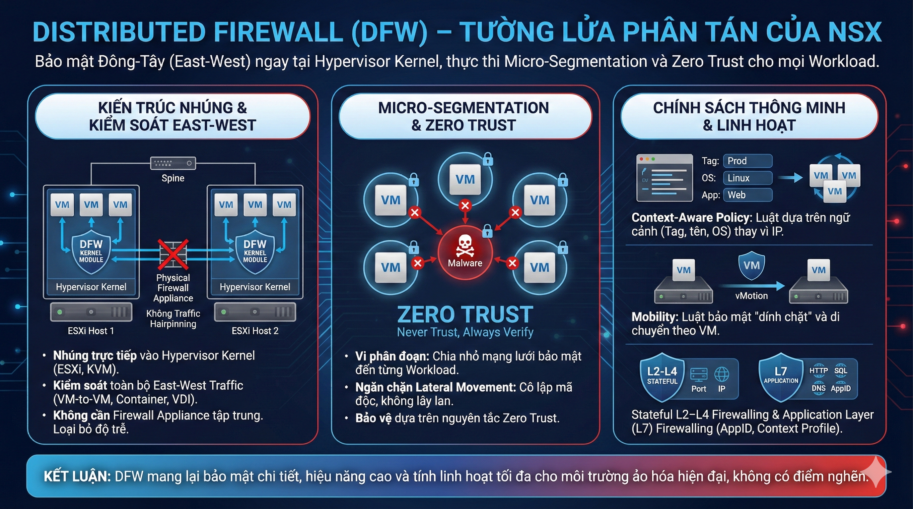

Các chức năng chính : 

- `Micro-segmentation` (Vi phân đoạn) & `Zero Trust`: Chia nhỏ mạng lưới bảo mật đến mức chi tiết nhất (từng VM, từng `Container`). Ngăn chặn việc một máy bị nhiễm mã độc lây lan sang máy bên cạnh (`Lateral Movement`).
- Kiểm soát `East-West Traffic`: Xử lý toàn bộ lưu lượng nội bộ trong Data Center mà không cần đẩy gói tin ra thiết bị phần cứng bên ngoài.
- `Context-Aware Policy`: Viết luật dựa trên ngữ cảnh (Tên VM, OS, Tag: Prod, Dev, Web) thay vì chỉ dựa vào IP/Port cứng nhắc.
- `Mobility` (Tính di động): Luật bảo mật "dính chặt" vào VM. Khi VM di chuyển (vMotion) sang Host khác, luật đi theo nó ngay lập tức.
- `Dynamic Grouping` : Rule tự động áp dụng khi VM có tag/AD group/vMotion.
- `Firewalling` : 
  - Stateful L2–L4 Firewalling: Theo dõi trạng thái kết nối và lọc theo IP/MAC/Port.
  - Application Layer (L7) Firewalling: Lọc dựa trên AppID và Context Profile.

Luồng hoạt động : 

  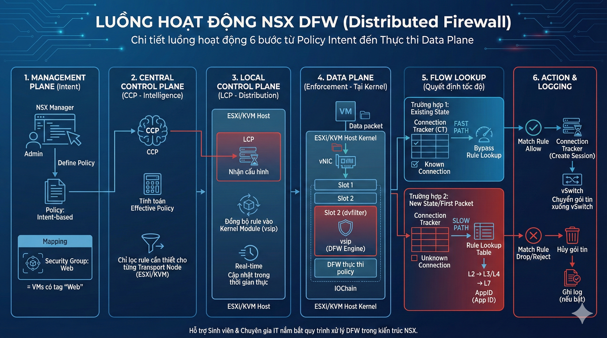

1. `Management Plane` (Intent):
- Admin định nghĩa `Policy` (Intent-based) trên `NSX Manager`.
- Mapping: `Security Group`: Web = VMs có tag 'Web'.

2. `Central Control Plane` (`CCP` - Intelligence):
- `NSX Manager` chuyển `Policy` xuống `CCP`.
- `CCP` tính toán `Effective Policy`: Chỉ lọc ra những rule nào cần thiết cho từng `Transport Node` (`ESXi`/`KVM`).

3. `Local Control Plane` (`LCP` - Distribution):
- `LCP` trên Host nhận cấu hình.
- Đồng bộ hóa rule vào `Kernel Module`
- `LCP` cập nhật cấu hình  trong thời gian thực (real-time).

4. `Data Plane` (Enforcement - Tại `Kernel`):
- Khi VM gửi hoặc nhận traffic → gói tin đi qua `IOChain` của `vNIC`.
- Slot 2 (`dvfilter`) chứa module `vsip` (`DFW` engine).
- Đây là nơi `DFW` thực thi policy.

5. Flow Lookup (Quyết định tốc độ):
- Tra cứu bảng trạng thái (Connection Tracker - CT):
  - Trường hợp 1 (Existing State): Nếu gói tin thuộc một kết nối đã được cho phép (có trong bảng CT) → FAST PATH → Cho qua ngay lập tức (Bypass Rule Lookup).
  - Trường hợp 2 (New State/First Packet): Nếu chưa có trong bảng CT → SLOW PATH → Duyệt qua bảng Rule (Rule Lookup) từ trên xuống dưới (L2 -> L3/L4 -> L7 AppID).

6. Action & Logging:
- Nếu Match Rule Allow: Tạo session mới trong bảng CT, chuyển gói tin xuống vSwitch.
- Nếu Match Rule Drop/Reject: Hủy gói tin, ghi log (nếu bật).

###### Identity Firewall (IDFW)

`Identity Firewall` (`IDFW`) là một tính năng mở rộng của `NSX Distributed Firewall` (`DFW`) cho phép áp dụng Firewall Rule dựa trên người dùng (user identity) thay vì dựa vào IP, VM, hay tag. `IDFW` tích hợp trực tiếp với `Active Directory` (`AD`) để biết user nào đăng nhập vào VM nào, từ đó áp dụng chính sách chính xác cho từng người dùng.

  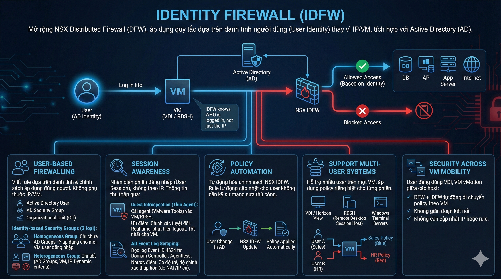

Các chức năng chính : 
- `User-based Firewalling` cho phép viết rule dựa trên danh tính và chính sách firewall áp dụng cho đúng người, không phụ thuộc vào IP hoặc VM.
  - `Active Directory` User
  - `AD` Security Group
  - Organizational Unit (OU)
  - Identity-based Security Groups
  - `IDFW` tạo được 2 loại nhóm:
    - `Homogeneous Group` : Chỉ chứa `AD Groups` → rule áp dụng cho mọi VM mà user đăng nhập.
    - `Heterogeneous Group` : Cho phép tạo ru một cách chi tiết
      - `AD Groups`
      - VM
      - IP
      - Dynamic criteria
- `Session Awareness` cho phép nhận diện phiên đăng nhập vào VM và Firewall xử lý theo “user session”, không theo địa chỉ IP. Và thông tin thu thập qua
  - `Guest Introspection` (Thin Agent): Cài một agent mỏng (qua VMware Tools) vào mỗi máy ảo (VM/RDSH).
    - Ưu điểm: Chính xác tuyệt đối, Real-time, phát hiện được cả phiên logout. Dùng tốt nhất cho IDFW trên máy ảo.
  - AD Event Log Scraping : NSX đọc log bảo mật từ Domain Controller để xem event login (Event ID 4624).
    - Ưu điểm: Không cần cài agent lên máy trạm (Agentless).
    - Nhược điểm: Có độ trễ nhất định và độ chính xác thấp hơn GI (do IP log có thể bị NAT hoặc cũ).
- `Policy Automation` cho phép tự động hóa chính sách `NSX IDFW` tự động cập nhật Rule cho user đó mà không cần kỹ sư mạng phải vào sửa Rule Firewall thủ công.
- `Support Multi-User Systems` hỗ trợ nhiều người dùng trên một máy, một VM có nhiều user login đồng thời, `IDFW` áp dụng policy đúng cho từng user riêng biệt và hỗ trợ :
  - VDI / Horizon View
  - RDSH (Remote Desktop Session Host)
  - Windows Terminal Servers
- `Security Across VM Mobility` cho phép user đang dùng một `VDI` và `VM vMotion` từ host này sang host khác:
  - `DFW` + `IDFW` tự động di chuyển policy theo VM
  - Không gián đoạn kết nối
  - Không cần cập nhật IP hoặc rule

Luồng hoạt động :

  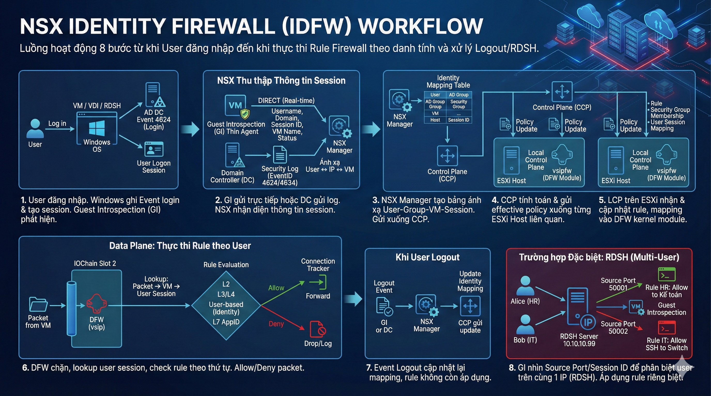

1. User đăng nhập vào VM / VDI / RDSH
- Windows ghi Event 4624 (login) → AD DC
- Windows tạo User Logon Session
- `Guest Introspection` (nếu có) phát hiện ngay lập tức

2. `NSX` thu thập thông tin user session
- Nếu sử dụng `Guest Introspection` (`GI`): `Thin Agent` trong VM gửi ngay thông tin và gửi DIRECT → NSX Manager (real-time): 
  - Username
  - Domain
  - Session ID
  - VM Name
  - Login/Logout status
- Nếu dùng DC Log Scraping (`Agentless`):
  - DC gửi Security Log
  - NSX đọc EventID 4624 / 4634
  - Ánh xạ user ↔ IP ↔ VM

3. `NSX Manager` tạo Identity Mapping

- `NSX Manager` xây bảng: User → `AD Group` → `Security Group` → VM → Session ID, trong đó:
  - User thuộc `AD Group` nào
  - User nằm trong Dynamic `Security Group` nào
  - VM của user hiện đang ở host nào
  - User còn đang logged in hay đã logout

  Mapping được gửi xuống `Control Plane`

4. `Central Control Plane` (`CCP`) gửi policy xuống mỗi ESXi Host
- Tại đây: `CCP` tính toán effective policy và mỗi host chỉ nhận policy liên quan đến các VM đang chạy trên host đó

5. `Local Control Plane` trên ESXi nhận rule và session
- Trên mỗi ESXi/KVM Host, `vsipfw` (`DFW` kernel module) cập nhật:
  - Rule
  - Security Group Membership
  - User Session Mapping

6. `Data Plane` thực thi rule dựa trên user
Khi gói tin đi ra từ VM:
- Step 1 – Traffic Interception : `DFW` chặn packet tại `IOChain Slot 2` (`vsip` module)
- Step 2 – Identify User Session : `DFW` lookup như sau packet → VM → user session mapping
- Step 3 – Rule Evaluation: Nếu packet là new connection
  - Check rule theo thứ tự:
    1. L2
    2. L3/L4
    3. User-based (Identity)
    4. L7 AppID (nếu bật Deep Inspection)

  Nếu user thuộc nhiều group → áp dụng tất cả rule (top-down).
- Step 4 – Action
  - Allow → lưu vào Connection Tracker
  - Deny → drop, log (nếu bật)
7. Khi user logout
  - `GI` hoặc `DC` Log gửi event logout
  - `NSX Manager` cập nhật lại Identity Mapping
  - `CCP` gửi update xuống ESXi host
  - Rule không còn áp dụng cho user này nữa

8. Trường hợp đặc biệt: `RDSH` (Nhiều người 1 IP) : Đây là phần phức tạp nhất mà bạn đã đề cập đúng trong mục `Support Multi-User Systems`. Luồng hoạt động có chút khác biệt:
- Vấn đề: Cả Alice (HR) và Bob (IT) đều remote vào cùng một Server RDSH có IP 10.10.10.99.
- Giải pháp: `Guest Introspection` không chỉ nhìn IP. Nó nhìn vào Cổng nguồn (Source Port) hoặc Session ID.
- `NSX` đánh dấu: Traffic từ Port 50001 là của Alice. Traffic từ Port 50002 là của Bob.
  - `Rule Firewall` được áp dụng chi tiết đến mức:
    - IP 10.10.10.99 + Port 50001 → Áp dụng Rule HR (Cho vào Server Kế toán).
    - IP 10.10.10.99 + Port 50002 → Áp dụng Rule IT (Cho SSH vào Switch).

##### Gateway Firewall (GFW)
`Gateway Firewall` (`GFW`) là là firewall áp dụng các quy tắc bảo mật tại vành đai mạng (`Perimeter`), chạy trên các `Tier-0` hoặc `Tier-1` Gateway (`Edge Nodes`). Nó kiểm soát lưu lượng Bắc-Nam (`North-South Traffic`) và hỗ trợ cả hai chế độ `Stateful` và `Stateless`.
Bảng phân loại rule: 
|Category|Giải thích|
|-|-|
|Emergency|Rule ưu tiên cao nhất, dùng cách ly khẩn cấp (quarantine), chặn hoặc allow tuyệt đối|
|System|T0: Rule do NSX tự tạo cho control-plane, BFD, VPN, overlay traffic|
|Shared Pre Rules|Rule global, áp dụng cho mọi Gateway|
|Local Gateway|Rule riêng của 1 gateway cụ thể (T0 hoặc T1)|
|Auto Service Rules|NSX tự generate rule cho dataplane (NAT, LB, DHCP, VPN)|
|Default|Rule mặc định cuối cùng nếu không khớp rule nào|

  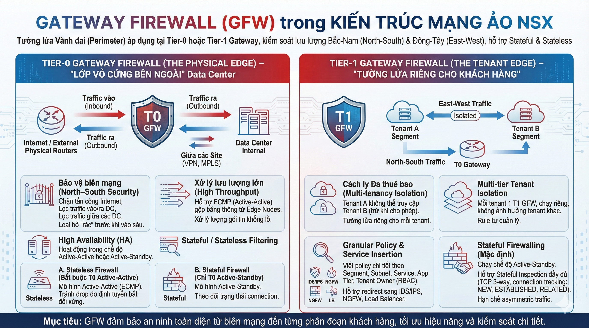

###### Gateway Firewall tại Tier-0 (The Physical Edge) 
`Tier-0 Gateway Firewall` được xem là `Perimeter Firewall` "Lớp vỏ cứng bên ngoài" của Data Center,đây là chốt chặn đầu tiên tiếp xúc với thế giới vật lý (Router Core, Internet).

- Nó xử lý North–South traffic, tức là lưu lượng:
  - Từ internal → Internet
  - Từ Internet → internal
  - Từ internal → External physical routers
  - Giữa các site (VPN site-to-site, MPLS, etc.)

Các chức năng chính của `Tier-0 Gateway Firewall`:
- Bảo vệ biên mạng (`North–South Security`) : Chỉ thực hiện các luật chặn/cho phép đơn giản dựa trên IP và Port. Mục tiêu là loại bỏ "rác" trước khi nó vào sâu bên trong.
    - Chặn tấn công từ Internet
    - Lọc traffic vào Data Center
    - Lọc traffic ra Internet
    - Lọc traffic giữa các DC (IPSec / L2VPN / EVPN)
- Xử lý lưu lượng lớn (`High Throughput`): Do `Tier-0` thường chạy chế độ `Active-Active` (`ECMP`) để gộp băng thông từ tất cả các `Edge Node`, Firewall ở đây phải xử lý lượng gói tin khổng lồ.
- `High Availability` : T0 firewall hoạt động trong Active-Active hoặc Active-Standby.
- `Stateful` / `Stateless` Filtering : Áp dụng firewall `stateful` hoặc `stateless` cho traffic đi xuyên T0.
  - A. Dùng `Stateless Firewall` (Bắt buộc cho T0 Active-Active)
    - Mô hình áp dụng: `Tier-0 Gateway` chạy chế độ Active-Active (`ECMP`).
    - Mục đích: Đảm bảo traffic không bị drop do định tuyến bất đối xứng.
  - B. Dùng `Stateful Firewall` (Chỉ dùng cho T0 Active-Standby)
      - Mô hình áp dụng: `Tier-0 Gateway` chạy chế độ Active-Standby.
      - Tại sao: Trong chế độ này, chỉ có 1 `Edge Node` xử lý traffic tại một thời điểm (Node kia ngủ đông). Do đó, traffic đi vào và đi ra luôn luôn đi qua cùng một Node. Không có hiện tượng bất đối xứng.
      - Ưu điểm: Bảo mật tốt hơn, cấu hình nhàn hơn (chỉ cần viết rule chiều đi, chiều về tự động allow).
      - Nhược điểm: Băng thông bị giới hạn bởi năng lực của 1 Node duy nhất (không gộp được băng thông).
- `Multi-tenant Segmentation` : Dùng để cách ly tenant hoặc segment lớn:
  - Tenant A không đi được ra Internet
  - Tenant B đi được
  - Tenant C chỉ đi qua MPLS
- Integration với Routing, NAT và VPN, T0 là nơi chứa:
  - BGP
  - OSPF
  - ECMP
  - SNAT/DNAT
  - IPSec VPN
  - L2VPN
  - EVPN

###### Gateway Firewall tại Tier-1 (The Tenant Edge)
`Tier-1 Gateway Firewall` là firewall xử lý East–West giữa các Segment logic hoặc North–South giữa Segment → T0. Đây là tường lửa dành riêng cho từng khách hàng (Tenant), từng dự án hoặc từng vùng mạng.

Các chức năng chính của `Tier-1 Gateway Firewall` : 
- Cách ly Đa thuê bao (Multi-tenancy Isolation): Đảm bảo Tenant A không thể truy cập sang Tenant B (trừ khi có luật cho phép). Đây là chức năng quan trọng nhất của `Tier-1 GFW`.
- `Multi-tier Tenant Isolation` :Trong mô hình multi-tenant
  - Mỗi tenant có 1 T1
  - Firewall chạy riêng trên T1 và không ảnh hưởng tenant khác
  - Rule cho phép tenant tự quản lý mà không ảnh hưởng hệ thống
  - T1 GFW cho phép viết policy ở mức chi tiết:
    - Theo Segment
    - Theo Subnet
    - Theo Service
    - Theo ứng dụng (App Tier)
    - Theo Tenant Owner (RBAC)

- `Stateful` Firewalling:
  - Tier-1 thường chạy chế độ Active-Standby (Service Router chỉ chạy trên 1 node tại 1 thời điểm).
  - Do đó, nó hỗ trợ Stateful Inspection đầy đủ :
    - Theo dõi TCP 3-way handshake
    - Theo dõi trạng thái connection NEW, ESTABLISHED, RELATED
    - Lưu state trong Service Router (SR) của T1
    - Cho phép asymmetric traffic ở mức hạn chế vì state nằm trên 1 node duy nhất
- Service Insertion / Redirect : T1 Firewall hỗ trợ redirect traffic sang:
  - IDS/IPS
  - NGFW (Palo Alto / Fortigate / Checkpoint)
  - Load balancer
  - Traffic analysis tool

#### b. Tìm hiểu mô hình triển khai NSX Firewall

  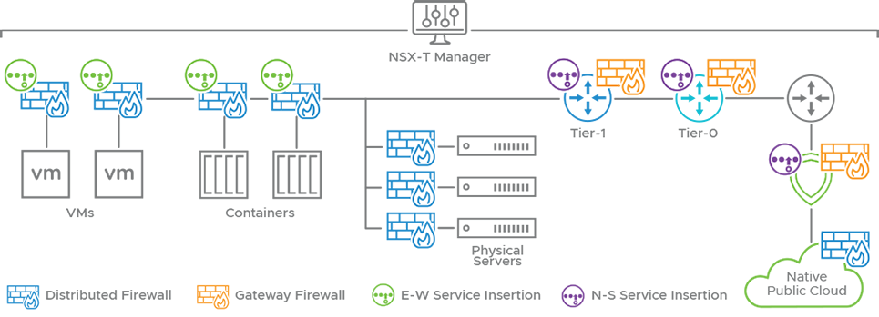

Mục tiêu khi triển khai mô hinh `NSX Firewall` là :

- Bảo vệ East–West (micro-segmentation) với `DFW`, giảm lateral movement.
- Bảo vệ North–South (perimeter) với `Gateway/Edge Firewall` (NAT, SNAT/DNAT, connection tracking).
- Đạt thruput, latency, scale, HA, và operability (logging, auditing, visibility).
- Tối ưu để tránh choke points: rule ở gần workload (`DFW`) để drop sớm; heavy inspection chỉ redirect khi cần.

Và trước khi triển khai `NSX Firewall` thì phải triển khai `NSX` như NSX Manager, ... đã nói ở trên.
Mô hình triển khai `NSX Firewall` chia thành 2 lớp bảo vệ chính đó là :
- `Gateway Firewall` (`GFW`) thì `GFW` được chaỵ trên các `NSX Edge Node` chia ra làm 2 phần ở `Tier-0/1`
  - Thì ở `Tier-0` sẽ làm nhiệm vụ kết nối từ Data-center ra Internet và nó làm các chức năng như đã nói ở phần trên
  - `Tier-1` thì đây là tường lửa cho từng khách hàng, project, các vùng server riêng biệt, giúp cách ly các khu vực với nhau.
- `Distributed Firewall` (`DFW`) nó là tường lửa nằm trên các VMs, Containers, ... để kiểm tra các lưu lượng từ `vNIC` đi ra ngoài, thực thi `Micro-Segmentation` ngăn chặn tấn công lay lan.

Phía trên là mô hình triển khai `NSX Firewall` được nói một cách lý thuyết, việc triển khai phải đợi thực hành thực tế mới rõ được.

#### c. Tại sao lại sử dụng NSX Firewall

Như đã biết thì `NSX Firewall` sẽ có nhưng lý do tại sao nên sử dụng nó : 
- Nó giải quyết bài toán của firewall truyền thống, chỉ có Firewall biên rất mạnh nhưng bên trong lỏng lẻo => `NSX Firewall` khắc phục nó bằng Micro-Segmentation ngăn chặn tấn công lây lan.
- Loại bỏ `bottlneck` và `hair-pinning` : với sơ đồ hệ thống mạng truyền thống thì 2 máy khác VLAN khi nói chuyện với nhau thì traffic vòng lên trên Firewall check rồi mới quay xún mặc dù 2 máy nằm trong cùng một hạ tầng vật lý, nó sẽ gây tốn băng thông và bị quá tải, độ trễ cao. `NSX Firewall` giải quyết bằng cách đặt Firewall nằm ngay trong các `Hyprvisor` và kiểm tra traffic ngay tại chỗ.
- Viết rule dựa trên các tag, VM, danh tính, không phụ thuộc vào IP, khi các VM di chuyển thì nó sẽ di chuyển theo.
- Cách ly đa thuê bao (multi-tenancy) NSX cho phép tạo hằng trăm Firewall ảo cho phép các đơn vị con của một công ty quản lý độc lập mà không tác động đến đơn vị khác.
- Tự động hóa : có thể thông qua terraform or ansible giúp tạo security group và rule ngay lặp tức.

### 3. Tìm hiểu High Availability (HA) trong NSX

#### a. High Availability trong NSX là gì ?
`High Availability` (`HA`) trong `NSX` là tập hợp các cơ chế phân tán – nhân bản – dự phòng – tự động failover được tích hợp trong toàn bộ kiến trúc NSX nhằm đảm bảo hệ thống mạng ảo (virtual networking) và firewall (`DFW`/`GFW`) luôn hoạt động liên tục, không bị gián đoạn khi xảy ra lỗi phần cứng, lỗi host, lỗi node, lỗi link hoặc lỗi component đảm bảo nguyên tắc: "No Single Point of Failure" (Không có điểm chết đơn lẻ).

`HA` trong `NSX` thì theo được tìm hiểu sẽ chia thành 3 khía cạnh hoạt động : 

  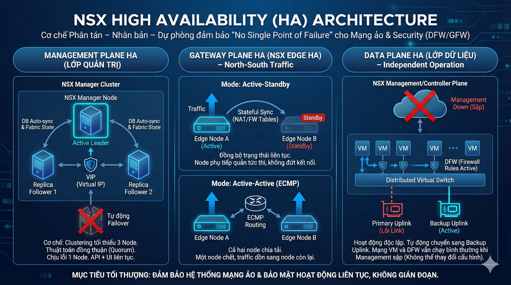

- `HA` ở lớp Quản trị (`Management Plane HA`) : Đảm bảo khả năng cấu hình và giám sát hệ thống luôn sẵn sàng.
  - Cơ chế: Sử dụng Clustering với tối thiểu 3 node `NSX Manager`. Trong cluster, 3 node: 1 node active, 2 node replica ,Backup database auto-sync hoạt động liên tục,  Fabric state không mất, Failover tự động nếu NSX Manager Active lỗi.
  - Hoạt động: Sử dụng thuật toán đồng thuận (Quorum). Cho phép chết tối đa 1 node mà hệ thống quản trị vẫn hoạt động bình thường. Có một IP ảo (VIP) để tự động trỏ về node đang hoạt động tốt.

- `HA` ở lớp Gateway (`NSX Edge HA`): Đây là phần quan trọng vì nó đảm bảo tính sẵn sàng cao cho lưu lượng Bắc-Nam (North-South), giúp hệ thống vẫn hoạt động ổn định ngay cả khi thiết bị phần cứng hoặc phần mềm gặp sự cố.
  - Cơ chế của nó là nhóm các `Edge Nodes` lại thành một `Edge Cluster`
  - Hoạt động :
    - Active-Standby: Một node chạy chính, một node ngủ. Dữ liệu trạng thái (Stateful table như bảng NAT, bảng Firewall connection) được đồng bộ liên tục. Khi Node chính chết, Node phụ bật dậy tiếp quản ngay lập tức mà không làm đứt kết nối của người dùng.
    - Active-Active: Cả hai node cùng chạy để chia tải (Load Balancing) thông qua giao thức định tuyến (ECMP). Nếu một node chết, traffic dồn sang node còn lại.

- HA ở  `Data Plane`
Đây là điểm đặc biệt nhất trong định nghĩa HA của NSX so với các giải pháp khác.
  - Cơ chế: Lớp dữ liệu (nơi gói tin đi qua) hoạt động độc lập với lớp quản trị và có cơ chế `Failover`, `Data Plane` tự động chuyển lưu lượng sang đường Uplink dự phòng khác (Backup Link) mà không cần hỏi ý kiến `NSX Manager` nếu đường truyền có ván đề. Điều này đảm bảo mạng không bị gián đoạn.
  - Hoạt động: Ngay cả khi toàn bộ cụm `NSX Manager` (`Management Plane`) và `Controller` bị sập hoàn toàn, thì hệ thống mạng của doanh nghiệp vẫn chạy bình thường. Các máy ảo vẫn ping thấy nhau, Firewall vẫn chặn đúng luật. Chỉ là bạn không thể thêm/sửa/xóa cấu hình mới cho đến khi khôi phục được Manager và tự Backup Link nếu đường truyền có vấn đề.

## Tính năng mạng và bảo mật khác

### Nhóm tính năng mạng

- NSX không chỉ bảo mật, nó còn tái định nghĩa lại cách chúng ta làm mạng (Network Virtualization).
  - Logical Switching (Chuyển mạch logic)

    - Overlay Networking (Geneve): NSX tạo ra các đường hầm (Tunnel) giữa các máy chủ vật lý. Điều này cho phép bạn kéo dài một mạng Layer 2 (VLAN) đi qua các Router Layer 3 mà không cần cấu hình lại switch vật lý.

    - Segment: Trong NSX, chúng ta gọi VLAN là "Segment". Bạn có thể tạo hàng nghìn Segment chỉ trong vài giây.

- Logical Routing (Định tuyến logic) - Tính năng "Killer"

    - Distributed Routing (DR): Đây là tính năng mạnh nhất. Router nằm ngay trong kernel của Hypervisor.

      - Ví dụ: VM A muốn gửi tin cho VM B (khác subnet) nằm cùng trên 1 host. Gói tin được định tuyến (Routing) ngay tại chỗ, không cần chạy ra Router vật lý rồi vòng lại. Tốc độ cực nhanh.

    - Tiered Routing (Tier-0 & Tier-1): Mô hình phân tầng giúp tách biệt quản trị (Provider quản lý T0, Tenant quản lý T1) như chúng ta đã thảo luận.

    - Dynamic Routing: Hỗ trợ đầy đủ BGP, OSPF, Static Route để nói chuyện với thế giới bên ngoài.

- IP Services (Dịch vụ IP)

    - NAT (Network Address Translation): Hỗ trợ SNAT, DNAT, Reflexive NAT. Quan trọng cho các môi trường Multi-tenant (nhiều khách hàng dùng trùng dải IP).

    - DHCP & DNS:

      - NSX có thể đóng vai trò làm DHCP Server hoặc DHCP Relay.

      - Đặc biệt là DNS Forwarder: Giúp phân giải tên miền ngay tại Gateway.

    - VPN:

      - L2 VPN: Kéo dài mạng LAN từ On-premise lên Cloud (giữ nguyên IP khi di chuyển lên mây).

      - IPSec / L3 VPN: Kết nối Site-to-Site bảo mật.

- Load Balancing (Cân bằng tải)

  - NSX tích hợp sẵn Load Balancer (L4 - L7) cơ bản.

  - Lưu ý chuyên gia: Với các nhu cầu cao cấp (WAF, GSLB), VMware khuyến nghị dùng NSX Advanced Load Balancer (Avi Networks), nhưng tính năng LB cơ bản tích hợp sẵn vẫn đủ dùng cho nhiều ứng dụng nội bộ.

### Nhóm tính năng bảo mật

- Đây là lý do chính khiến khách hàng "xuống tiền" mua NSX. Chúng ta gọi là Intrinsic Security (Bảo mật nội tại).
  - Segmentation (Phân đoạn mạng)

    - Micro-segmentation: Chia nhỏ vùng bảo mật đến từng máy ảo (như đã bàn ở phần Firewall).

    - Distributed Firewall (DFW): Stateful Firewall L2-L4 chạy ở Kernel.

    - Gateway Firewall (GFW): Firewall biên chạy ở Edge.

  - Advanced Threat Prevention (ATP) - Ngăn chặn mối đe dọa nâng cao : Firewall chỉ chặn được Port (L4). ATP mới chặn được Mã độc (L7).

    - Distributed IDS/IPS:

      - Khác biệt: Thay vì mua một thiết bị IPS đắt tiền và dồn toàn bộ traffic về đó (gây nghẽn), NSX biến mỗi máy chủ ESXi thành một IPS.

      - Tác dụng: Phát hiện tấn công khai thác lỗ hổng (như Log4j, WannaCry) ngay trong traffic nội bộ (East-West).

      - Virtual Patching: Nếu server chưa kịp vá lỗi Windows, IDS/IPS sẽ chặn gói tin tấn công lỗ hổng đó giúp server an toàn.

    - Malware Prevention: Sử dụng Sandboxing để phát hiện file lạ/mã độc trong traffic mạng.
    - Network Traffic Analysis (NTA/NDR): Phân tích hành vi bất thường (Anomaly Detection). Ví dụ: Một máy chủ in ấn tự nhiên gửi 10GB dữ liệu ra ngoài Internet -> Cảnh báo ngay.

  - Identity & Context Awareness

    - Identity Firewall (IDFW): Viết luật dựa trên User AD (Active Directory).

    - FQDN Filtering: Cho phép viết rule firewall dựa trên tên miền (ví dụ: Cho phép VM truy cập *.google.com thay vì phải tìm list IP của Google).

--------------------------------------------------------

Phần này thuật ngữ tìm hiểu về NSX, em làm thêm nhưng em làm chưa xong

## Kiến thức thuật ngữ

1. **SDN (Software-Defined Networking)** : Là mạng được định nghĩa bằng phần mềm. Vậy nó có nghĩa là gì ?
- Hãy lấy ví dụ : `trong mô hính mạng truyền thống thì mỗi thiết bị mạng như router, switch đề có "bộ não riêng" và tự đưa ra quyết định chuyển tiếp gói tin`. 
- Thì trong **SDN**, kiến trúc này sẽ cho phép tách biệt phần `bộ não` ra khỏi `cơ thể`. Và **SDN** chuyển quyền kiểm soát các cơ thể riêng lẻ sang tập chung, có nghĩa là một bộ não tập trung sẽ kiểm soát các cơ thể riêng lẻ.

  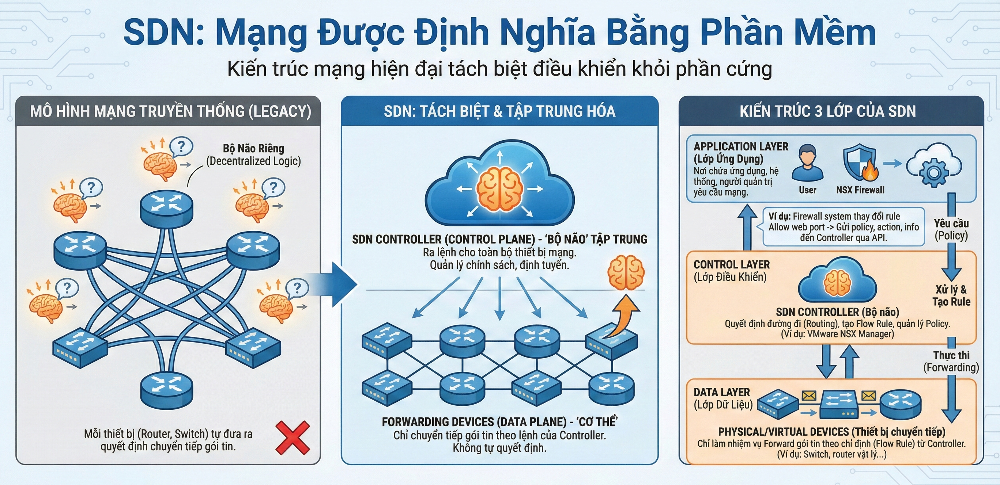

- 2 phần tách biệt này trong **SDN** gọi là :
    - **Control Plane** : Đây là phần được tách ra và đừa về trung tâm quản lý gọi là **SDN Controller**. Controller này sẽ ra lệnh cho toàn bộ thiết bị mạng.
    - **Data Plane** : Đơn giản đây là phần cứng như `switch, router`, chúng chỉ chuyển tiếp gói tin theo lệnh của Controller.
- Kiến trúc 3 lớp của **SDN**
    - **Application Layer** : Là nơi chứa các ứng dụng, hệ thống, hoặc người quản trị yêu cầu mạng làm gì.
        - Ví dụ như Firewall system (NSX Firewall) thay đổi một rule là Allow web port thì firewall sẽ gửi policy, action (allow), infomation (source, destination, port)-> gửi đến `controller` thông qua API -> đẩy xuống `data plane` thành flow rule.
    - **Control Layer** : Là bộ não của SDN quyết định đường đi (routing), tạo flow rule, quản lý policy
        - Ví dụ như VMware NSX Manager.
    - **Data Layer** : Là lớp chuyển gói tin thực đến các thiết bị router, switch, chỉ làm nhiện vụ forward gói tin theo chỉ định từ controller, không tự quyết định.
        - Ví dụ như Switch, router vật lý, ...

2. `NSX Transport Node` là một Server cài đặt Hypervisor (ESXi, KVM), `NSX Manager` kết nối với các `Transport Node` để điều khiển cài đặt `MPA Agent`, `LCP Daemon` và `Forwarding Engine`. 

3. `Edge Transport Nodes` là những `Transport Node` đặc biệt với khả năng chạy các dịch vụ mạng tập trung để thực hiện các chức năng Routing, NAT, DHCP, Load Balancing, VPN, … trong hạ tầng mạng ảo. `Transport Node` trải dài từ `Management Plane`, `Control Plane` cho tới `Data Plane`.

4. N-VDS (NSX Virtual Distributed Switch): đóng vai trò như một vSwitch để thực hiện Forwarding Traffic giữa các Segment và Transport Zone bên trong Transport Node. N-VDS chỉ hỗ trợ ESXi Hypervisor, đối với KVM thì phải sử dụng Open vSwitch (OVS) thay thế.

- `GENEVE` (`Generic Network Virtualization Encapsulation`) - UDP Port 6081.
Tại sao không dùng VXLAN (như NSX-V cũ)?
- VXLAN có Header cố định, rất khó mở rộng.
- GENEVE linh hoạt hơn: Nó cho phép chèn thêm các thông tin phụ (Metadata/TLV) vào Header.
- Ví dụ sức mạnh của GENEVE: Khi gói tin đi từ Host A sang Host B, nhờ GENEVE, Host B không chỉ nhận được dữ liệu mà còn biết: "Gói tin này có nguồn gốc từ Tenant nào? Có cần đo lường độ trễ không? Đã đi qua Firewall chưa?"

<!-- 2. **Entry Point**

3. **Cluster**

4. **MPA**

5. **Forwarding Engine** -->

Phần này em làm thêm mấy thuật ngữ em chưa biết